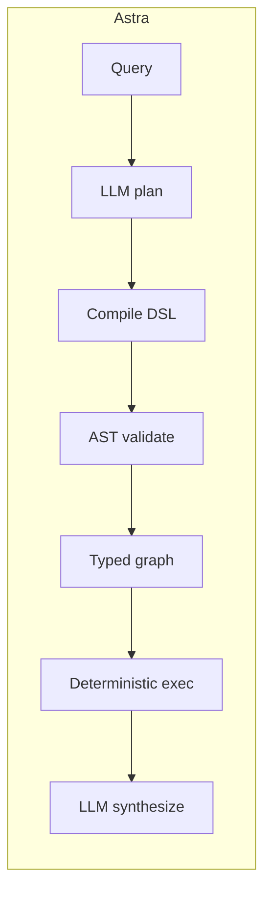
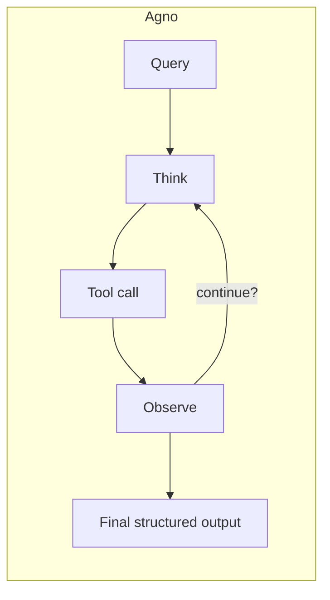

## TL;DR

| | Astra | Agno |
| --- | --- | --- |
| Architecture | Compiled DSL: LLM emits restricted Python, AST-validated, executed deterministically | Fast ReAct tool-loop with rich agent + team primitives |
| LLM calls (4-analyst) | **3.0** | ~16 (pooled ReAct) |
| Tokens (mean / p95) | **21,013 / 28,804** | 49,219 / 85,452 (pooled) |
| Wall p50 | **26.1 s** | 50.3 s (pooled) |
| Replans mid-execution | No | Yes (per ReAct step) |
| Determinism | Strong (typed graph) | Moderate (loop bounds + structured outputs) |
| Best for | Workloads where the graph is bounded and known | Tool-heavy workflows with a large ecosystem |

Pooled ReAct numbers are the combined Agno + CrewAI + AutoGen baseline (54 trials) from the [Astra benchmark](https://github.com/astra-dev/astra/blob/main/readme.md). Full data: [`benchmarking/`](https://github.com/astra-dev/astra/blob/main/benchmarking/).

## Architecture difference

Agno is a mature, fast ReAct framework with first-class tool-calling, structured outputs, teams, and storage. It runs the language model in a tight loop: think, call a tool, observe, repeat until done. The loop is well-instrumented, the typing on tools is good, and the ecosystem is large.

Astra targets the same shape of workflow - analyst teams, typed tools, structured outputs - but compiles the plan instead of looping. One LLM call drafts the plan, one compiles it to executable DSL, one synthesizes the final answer; in between, the deterministic executor walks a typed graph.

Because Agno's loop is fast and the ecosystem is broad, raw throughput is good. The cost difference shows up when a workflow has many tools - each tool result re-enters the loop and costs another full LLM call.

## Cost analysis

| Metric | Astra | ReAct pool (Agno + CrewAI + AutoGen) | Ratio |
| --- | --- | --- | --- |
| LLM calls | 3.0 | 16.1 | 5.37x |
| Tokens (mean) | 21,013 | 49,219 | 2.34x |
| Tokens (p95) | 28,804 | 85,452 | 2.97x |
| Wall p50 (s) | 26.1 | 50.3 | 1.93x |
| n (trials) | 18 | 54 | -- |

The Agno-only slice is published alongside the pooled numbers in [`benchmarking/`](https://github.com/astra-dev/astra/blob/main/benchmarking/) - Agno is the fastest of the three ReAct frameworks in the pool but still calls the model many more times than Astra on the same workload.

## When to choose each

Choose **Agno** when:

- You want the maturity, documentation, and integrations of a widely-adopted framework.
- The workflow is tool-heavy and you want easy switching between LLM providers.
- ReAct's mid-execution adaptivity is genuinely useful for your task.
- You are doing rapid prototyping where compile-time validation would slow you down.

Choose **Astra** when:

- Your cost-per-query has to fit a strict budget (3 LLM calls instead of 16).
- You want typed graph execution with AST-validated DSL, not a tool-loop.
- The workflow shape is fairly stable - research pipelines, classification, multi-stage analysis.
- See [Investment Team](/cookbook/investment-team) for the canonical compiled-pipeline pattern.

## Honest tradeoffs

Agno is fast, well-engineered, and has a much larger community and ecosystem than Astra has today. If your workflow involves five or fewer tool calls per query and you value flexibility over cost ceiling, Agno is the safer choice. Astra wins on bounded cost and structured determinism, and it wins by larger margins as the tool count and team depth grow.

<Warning>
Astra does not replan mid-execution. If a workflow's next step legitimately depends on what an earlier tool returned, a ReAct loop adapts and Astra doesn't (yet). Use ReAct frameworks for open-ended exploratory workflows.
</Warning>
