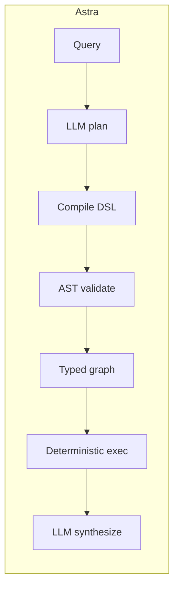
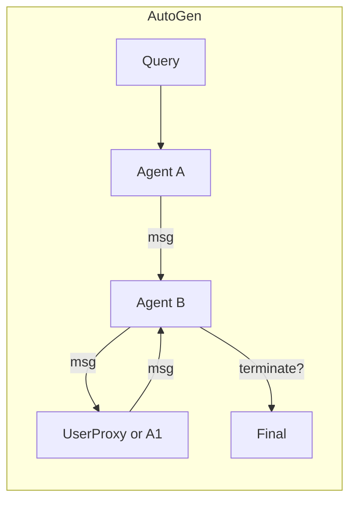

## TL;DR

| | Astra | AutoGen |
| --- | --- | --- |
| Architecture | Compiled DSL: LLM emits restricted Python, AST-validated, executed deterministically | Multi-agent conversation; agents chat to solve tasks |
| LLM calls (4-analyst) | **3.0** | ~16 (pooled ReAct) |
| Tokens (mean / p95) | **21,013 / 28,804** | 49,219 / 85,452 (pooled) |
| Wall p50 | **26.1 s** | 50.3 s (pooled) |
| Replans mid-execution | No | Yes (per chat turn) |
| Determinism | Strong (typed graph) | Weak (conversation drift, unbounded turns) |
| Best for | Bounded analytical pipelines | Human-in-the-loop and conversational workflows |

Pooled ReAct numbers are the combined Agno + CrewAI + AutoGen baseline (54 trials) from the [Astra benchmark](https://github.com/astra-dev/astra/blob/main/readme.md). Full data: [`benchmarking/`](https://github.com/astra-dev/astra/blob/main/benchmarking/).

## Architecture difference

AutoGen models multi-agent work as a *conversation*. Agents send messages to each other; a `UserProxyAgent` can sit in the loop to approve, edit, or veto. The conversation continues until a termination condition fires. This is a great primitive for workflows where the next step is genuinely "ask another agent" or "ask the user".

Astra models multi-agent work as a *compiled graph*. The planner LLM emits one Python program that calls every agent it needs, the compiler validates the call graph against typed tool signatures, and the executor walks the graph deterministically with no chat in the middle.

Conversation gives AutoGen strong human-in-the-loop ergonomics: the user is just another participant. The trade is total cost - every turn is a full prompt + completion, and chat patterns drift over many turns.

## Cost analysis

| Metric | Astra | ReAct pool (Agno + CrewAI + AutoGen) | Ratio |
| --- | --- | --- | --- |
| LLM calls | 3.0 | 16.1 | 5.37x |
| Tokens (mean) | 21,013 | 49,219 | 2.34x |
| Tokens (p95) | 28,804 | 85,452 | 2.97x |
| Wall p50 (s) | 26.1 | 50.3 | 1.93x |
| n (trials) | 18 | 54 | -- |

The cost-ceiling story is especially clear against conversational frameworks. A 4-analyst Astra pipeline has a hard 3-LLM-call ceiling regardless of input. An AutoGen group chat has no such ceiling - if the agents disagree, they will keep messaging until the termination condition fires. Numbers from [`readme.md`](https://github.com/astra-dev/astra/blob/main/readme.md) lines 18-25; per-trial breakdown in [`benchmarking/`](https://github.com/astra-dev/astra/blob/main/benchmarking/).

## When to choose each

Choose **AutoGen** when:

- The user is part of the loop and needs to approve or edit agent messages mid-run.
- The workflow is genuinely conversational (debate, negotiation, multi-round refinement).
- Termination conditions are easier to express as "agent says done" than as a graph shape.
- You need Microsoft's research ecosystem integrations.

Choose **Astra** when:

- You want a hard cost ceiling per query.
- The workflow is analytical and the same input should produce the same structured output.
- You want compile-time AST validation of every agent + tool call.
- See [Enterprise Teams](/cookbook/enterprise-teams) for a multi-team example where AutoGen's chat shape would balloon the token bill.

## Honest tradeoffs

AutoGen's conversation primitive is genuinely the right shape for some workflows - human-in-the-loop approvals, multi-round critique, agents debating a draft. Astra cannot replicate that experience without giving up its cost ceiling. Where Astra wins is when the workflow has a stable structure that the planner can capture in one DSL emission instead of N chat turns.

<Warning>
Astra does not replan mid-execution. If a workflow's next step legitimately depends on what an earlier tool returned, a ReAct loop adapts and Astra doesn't (yet). Use ReAct frameworks for open-ended exploratory workflows.
</Warning>
