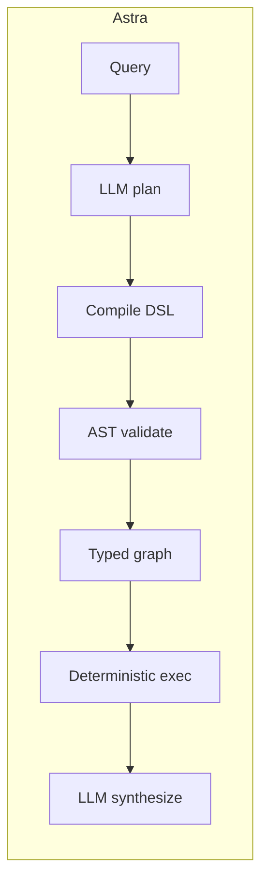
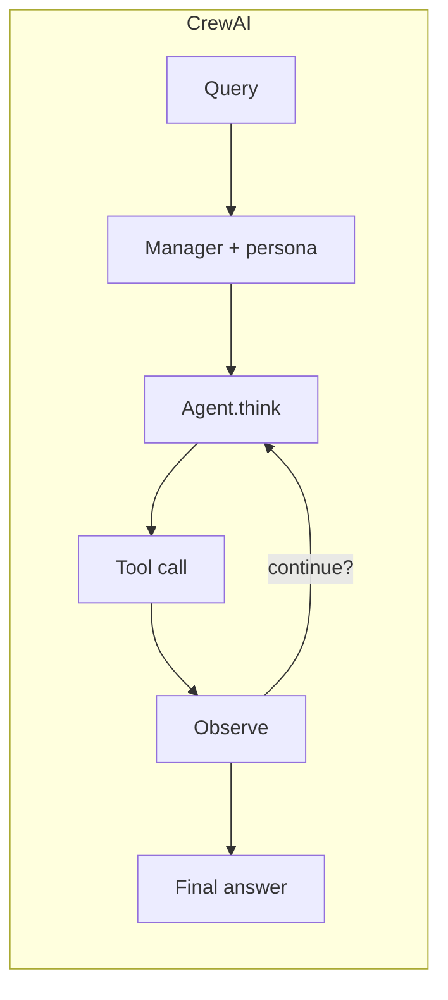

## TL;DR

| | Astra | CrewAI |
| --- | --- | --- |
| Architecture | Compiled DSL: LLM emits restricted Python, AST-validated, executed deterministically | ReAct loop with role-played agents ("crew") |
| LLM calls (4-analyst) | **3.0** | ~16 (pooled ReAct) |
| Tokens (mean / p95) | **21,013 / 28,804** | 49,219 / 85,452 (pooled) |
| Wall p50 | **26.1 s** | 50.3 s (pooled) |
| Replans mid-execution | No | Yes (per ReAct step) |
| Determinism | Strong (typed graph) | Weak (persona variance + loop nondeterminism) |
| Best for | Repeatable analytical pipelines | Creative tasks where persona matters |

Pooled ReAct numbers are the combined Agno + CrewAI + AutoGen baseline (54 trials) from the [Astra benchmark](https://github.com/astra-dev/astra/blob/main/readme.md). Full data: [`benchmarking/`](https://github.com/astra-dev/astra/blob/main/benchmarking/).

## Architecture difference

CrewAI gives every agent a *role*, a *goal*, and a *backstory*. Agents then collaborate in a ReAct loop: each step the model reads context, picks a tool, observes the result, and decides whether to keep going. The richness comes from persona prompting; the cost comes from the loop.

Astra discards personas. Each agent is a typed function with a tool list; the planner LLM emits a deterministic Python program that calls them in the order the compiler will then validate.

Persona prompting helps when the answer benefits from a particular voice (a creative writer agent, a sales-style outreach agent). It hurts when you want the same input to produce the same structured output across runs.

## Cost analysis

| Metric | Astra | ReAct pool (Agno + CrewAI + AutoGen) | Ratio |
| --- | --- | --- | --- |
| LLM calls | 3.0 | 16.1 | 5.37x |
| Tokens (mean) | 21,013 | 49,219 | 2.34x |
| Tokens (p95) | 28,804 | 85,452 | 2.97x |
| Wall p50 (s) | 26.1 | 50.3 | 1.93x |
| n (trials) | 18 | 54 | -- |

The 2.97x tail gap on tokens is the cost of the ReAct loop's unboundedness: a single noisy tool result can trigger several recovery passes, each of which is another full prompt + completion. Numbers from [`readme.md`](https://github.com/astra-dev/astra/blob/main/readme.md) lines 18-25.

## When to choose each

Choose **CrewAI** when:

- You want agents to *feel* like distinct collaborators (sales SDR + closer, writer + editor + critic).
- The task is open-ended and benefits from creative variance.
- You are prototyping a workflow you have not yet locked down.
- Persona-driven prompting is part of the product.

Choose **Astra** when:

- You need reproducible outputs - same input, same structured result.
- Cost per query has to fit a fixed budget.
- The workflow is analytical (research, classification, multi-step reasoning over typed data).
- See [Investment Team](/cookbook/investment-team) for the 7-agent equivalent that costs 3 calls instead of 16.

## Honest tradeoffs

CrewAI's strength is *expressiveness*. Personas give workflows a human shape that is often valuable for creative or relational tasks - a Pythonic typed graph cannot replace that. Astra trades persona variance for cost predictability and determinism; that is the right trade for analytical pipelines and the wrong trade for creative writing.

<Warning>
Astra does not replan mid-execution. If a workflow's next step legitimately depends on what an earlier tool returned, a ReAct loop adapts and Astra doesn't (yet). Use ReAct frameworks for open-ended exploratory workflows.
</Warning>
