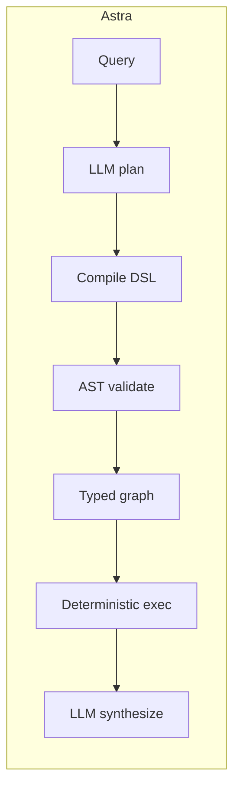
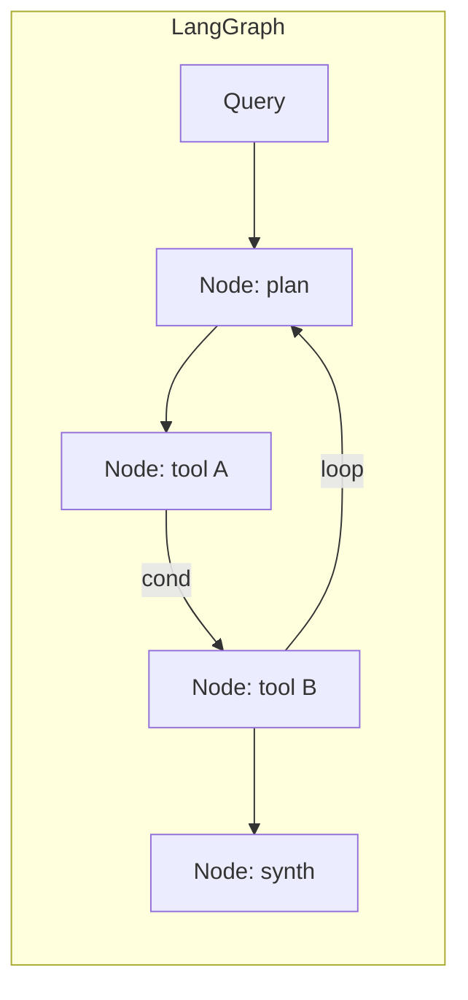

## TL;DR

| | Astra | LangGraph |
| --- | --- | --- |
| Architecture | Compiled DSL: LLM emits restricted Python, AST-validated, executed deterministically | Hand-built state machine of nodes and edges |
| LLM calls (4-analyst) | **3.0** | 10.4 |
| Tokens (mean / p95) | **21,013 / 28,804** | 29,645 / 55,086 |
| Wall p50 | **26.1 s** | 32.4 s |
| Replans mid-execution | No | Yes (via conditional edges) |
| Determinism | Strong (typed graph) | Strong (explicit graph) |
| Best for | Workflows where the graph is implicit in the prompt | Workflows where the graph is known in advance |

Numbers from the [Astra benchmark](https://github.com/astra-dev/astra/blob/main/readme.md) (90 trials, investment-research workload). Full per-query data: [`benchmarking/`](https://github.com/astra-dev/astra/blob/main/benchmarking/).

## Architecture difference

LangGraph asks you to *declare* the graph: write nodes, write edges (some conditional), then run a state machine. The graph is your code. Astra *infers* the graph: the LLM emits a short restricted-Python program, the compiler validates it against typed tool signatures, and the runtime executes a deterministic typed graph derived from the AST.

In LangGraph, every node that needs reasoning is an LLM call. The 4-analyst investment workload requires roughly 10 LLM calls because each analyst is a node and the conditional routing logic invokes the model to decide where to go next. Astra emits the whole 4-analyst plan in one LLM call, then walks the typed graph with zero further model invocations until synthesis.

## Cost analysis

| Metric | Astra | LangGraph | Ratio (LG / Astra) |
| --- | --- | --- | --- |
| LLM calls | 3.0 | 10.4 | 3.47x |
| Tokens (mean) | 21,013 | 29,645 | 1.41x |
| Tokens (p95) | 28,804 | 55,086 | 1.91x |
| Wall p50 (s) | 26.1 | 32.4 | 1.24x |
| n (trials) | 18 | 18 | -- |

The tail (p95 tokens) is where the gap widens. LangGraph's conditional edges can loop and call the LLM additional times when a state check fails; Astra's compiled graph has no loops it did not declare at compile time. Numbers from [`readme.md`](https://github.com/astra-dev/astra/blob/main/readme.md) lines 18-25; per-trial breakdown in [`benchmarking/`](https://github.com/astra-dev/astra/blob/main/benchmarking/).

## When to choose each

Choose **LangGraph** when:

- The workflow is a known state machine you want to author by hand.
- Edges depend on tool output in ways the model needs to re-evaluate (true conditional routing).
- You need first-class checkpointing and time-travel debugging across long-running runs.
- You are already invested in the LangChain ecosystem.

Choose **Astra** when:

- The graph shape varies per query and you do not want to maintain a router.
- Cost predictability matters - you want a hard ceiling on LLM calls per query.
- You want a typed DSL that the compiler can validate before execution.
- See [Investment Team](/cookbook/investment-team) for the canonical 4-team pipeline.

## Honest tradeoffs

LangGraph's strength is *explicitness*. When you have already drawn the workflow on a whiteboard, writing it as a `StateGraph` is a perfect fit, and the conditional edges are a real feature - they let the graph adapt as it runs. Astra trades that adaptivity for a bounded cost ceiling and less boilerplate.

<Warning>
Astra does not replan mid-execution. If a workflow's next step legitimately depends on what an earlier tool returned, a ReAct loop adapts and Astra doesn't (yet). Use ReAct frameworks for open-ended exploratory workflows.
</Warning>
