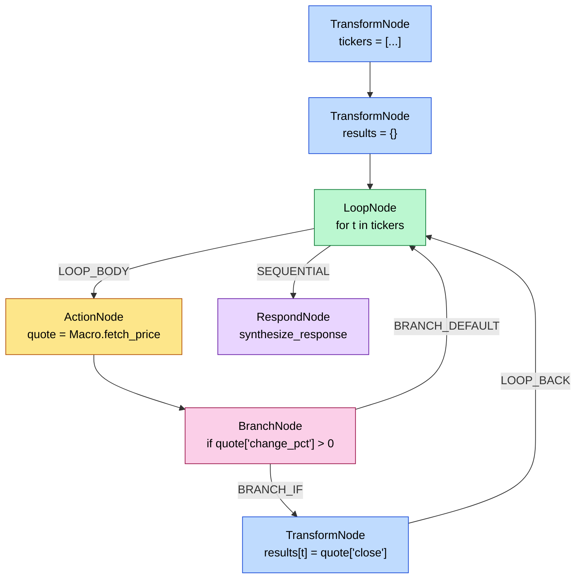

<Note>
ReAct frameworks decide control flow one token at a time, mid-prompt. Astra commits to a static, typed graph the instant the planner finishes — every branch, loop, and tool call is materialized before execution begins.
</Note>

## The five node types

<CardGroup cols={5}>
  <Card title="Action" icon="bolt">
    Tool dispatch
  </Card>
  <Card title="Transform" icon="function">
    Pure expression
  </Card>
  <Card title="Branch" icon="code-branch">
    if / else
  </Card>
  <Card title="Loop" icon="rotate">
    for iteration
  </Card>
  <Card title="Respond" icon="flag-checkered">
    Terminal output
  </Card>
</CardGroup>

Each node is a frozen-ish dataclass defined in [nodes.py](https://github.com/astra-dev/astra/blob/main/framework/src/framework/code_mode/compiler/nodes.py) and tagged with a `NodeType` enum value.

## From AST to graph

The `WorkflowBuilder.walk()` method ([workflow_builder.py:464](https://github.com/astra-dev/astra/blob/main/framework/src/framework/code_mode/compiler/workflow_builder.py#L464)) iterates over validated top-level statements and dispatches each to a handler. The handler emits one or more nodes plus the edges that wire them into the existing graph.

The builder tracks a list called `_open_tails` ([workflow_builder.py:133](https://github.com/astra-dev/astra/blob/main/framework/src/framework/code_mode/compiler/workflow_builder.py#L133)). Every entry is `(source_id, edge_factory)`: nodes whose outgoing edge has not been wired yet. When the next statement appends a node, `_chain_next_node()` drains the tails by calling each factory to produce an `Edge` ([workflow_builder.py:143](https://github.com/astra-dev/astra/blob/main/framework/src/framework/code_mode/compiler/workflow_builder.py#L143)). This pattern is what lets branches fork into two tails and reconverge cleanly.

## Node schemas

<AccordionGroup>
  <Accordion title="ActionNode — call a tool">
    Definition at [nodes.py:36](https://github.com/astra-dev/astra/blob/main/framework/src/framework/code_mode/compiler/nodes.py#L36).
    - `tool: str` — qualified `{agent_id}.{tool_slug}`.
    - `inputs: dict[str, str]` — kwarg name to **expression string** (unparsed via `ast.unparse`).
    - `outputs: dict[str, str]` — typically `{"result": "<state_var>"}` when the call is the rhs of an assignment.
  </Accordion>
  <Accordion title="TransformNode — pure expression">
    Definition at [nodes.py:48](https://github.com/astra-dev/astra/blob/main/framework/src/framework/code_mode/compiler/nodes.py#L48).
    - `expression: str` — Python expression evaluated against current state.
    - `assign_to: str` — destination key in the state dict, or empty for a bare expression.
  </Accordion>
  <Accordion title="BranchNode — conditional fork">
    Definition at [nodes.py:74](https://github.com/astra-dev/astra/blob/main/framework/src/framework/code_mode/compiler/nodes.py#L74). Has a single `condition: str` and emits exactly one `BRANCH_IF` edge plus one `BRANCH_ELSE` or `BRANCH_DEFAULT` edge.
  </Accordion>
  <Accordion title="LoopNode — for iteration">
    Definition at [nodes.py:86](https://github.com/astra-dev/astra/blob/main/framework/src/framework/code_mode/compiler/nodes.py#L86).
    - `over: str` — expression producing the collection.
    - `as_var: str` — loop variable (or `"(a, b)"` for tuple unpacking).
    - `max_iterations: int = 1000` — hard safety cap.
  </Accordion>
  <Accordion title="RespondNode — terminal">
    Definition at [nodes.py:62](https://github.com/astra-dev/astra/blob/main/framework/src/framework/code_mode/compiler/nodes.py#L62). A single `message: str` expression that produces the workflow's response. Plan validation requires at least one and forbids any outgoing edges from it ([plan_validator.py:82](https://github.com/astra-dev/astra/blob/main/framework/src/framework/code_mode/compiler/plan_validator.py#L82)).
  </Accordion>
</AccordionGroup>

## Edges and control flow

There are six edge types ([edges.py:6](https://github.com/astra-dev/astra/blob/main/framework/src/framework/code_mode/compiler/edges.py#L6)):

| Type             | Meaning                                                |
| ---------------- | ------------------------------------------------------ |
| `SEQUENTIAL`     | Normal A → B step                                      |
| `BRANCH_IF`      | Taken when the branch condition evaluates to true      |
| `BRANCH_ELSE`    | Taken when condition is false **and** an `else` block exists |
| `BRANCH_DEFAULT` | Taken when condition is false and no `else` block exists |
| `LOOP_BODY`      | From a `LoopNode` to the first node of its body        |
| `LOOP_BACK`      | From the last node of the body **back** to the `LoopNode` |

### Branches

`_handle_if()` ([workflow_builder.py:206](https://github.com/astra-dev/astra/blob/main/framework/src/framework/code_mode/compiler/workflow_builder.py#L206)) emits a `BranchNode`, walks the `then` body with `branch_if` as the pending edge factory, snapshots the resulting tails, then walks the `orelse` with `branch_else`. Both sets of tails are merged into `_open_tails`, so the next statement after the `if` becomes the join point automatically.

### Loops

`_handle_for()` ([workflow_builder.py:154](https://github.com/astra-dev/astra/blob/main/framework/src/framework/code_mode/compiler/workflow_builder.py#L154)) emits a `LoopNode`, walks the body with `loop_body` as the first edge, then wires every body tail back to the `LoopNode` via `loop_back`. After the loop, `_open_tails` is `[(loop_id, sequential)]` — the next statement gets a `SEQUENTIAL` edge from the loop, which the executor follows once the collection is exhausted.

## The ExecutionWorkflow dataclass

Final IR is packed into `ExecutionWorkflow` ([workflow_builder.py:63](https://github.com/astra-dev/astra/blob/main/framework/src/framework/code_mode/compiler/workflow_builder.py#L63)):

```python
@dataclass
class ExecutionWorkflow:
    name: str = ""
    description: str = ""
    entry: str = ""                     # id of the first node
    nodes: list[Node] = field(default_factory=list)
    edges: list[Edge] = field(default_factory=list)
    state_variables: list[str] = field(default_factory=list)
    config: WorkFlowConfig = field(default_factory=WorkFlowConfig)
```

`state_variables` is populated incrementally by `_register_state_variable()` whenever the builder sees an assignment target or loop variable. The runtime uses this list to pre-allocate the state namespace.

## Reachability and termination guarantees

After the builder finishes, `validate_plan()` ([plan_validator.py:197](https://github.com/astra-dev/astra/blob/main/framework/src/framework/code_mode/compiler/plan_validator.py#L197)) runs a battery of graph-structural checks: every node is reachable from `entry`, every edge references a real node, every `LoopNode` has exactly one `LOOP_BODY` and at least one `LOOP_BACK`, every `BranchNode` has exactly one true edge and one false edge, every workflow has at least one `RespondNode`, no node IDs collide, and no edge is a self-loop.

Runtime bounds come from `WorkFlowConfig` ([workflow_builder.py:53](https://github.com/astra-dev/astra/blob/main/framework/src/framework/code_mode/compiler/workflow_builder.py#L53)):

<ParamField path="max_execution_seconds" type="int" default="300">
Wall-clock budget for the entire run. Enforced before every node tick.
</ParamField>
<ParamField path="max_nodes" type="int" default="10_000">
Cap on total node visits across the run (counts every loop iteration).
</ParamField>
<ParamField path="max_visits_per_node" type="int" default="5_000">
Per-node visit cap. Catches accidental unbounded loops even when `max_nodes` would otherwise allow them.
</ParamField>
<ParamField path="state_size_limit_mb" type="int" default="50">
Soft cap on the in-memory state dict; large tool outputs are summarized before being assigned.
</ParamField>

## Worked example

Given this DSL:

```python
tickers = ["AAPL", "MSFT"]
results = {}
for t in tickers:
    quote = Macro.fetch_price(ticker=t)
    if quote["change_pct"] > 0:
        results[t] = quote["close"]
synthesize_response(results)
```

The compiler emits:



Note how `BRANCH_DEFAULT` routes back to the loop directly because the source `if` has no `else` clause. The loop's `SEQUENTIAL` edge fires only when the collection is exhausted, taking the cursor to the terminal `RespondNode`.

<Tip>
The IR is JSON-serializable. Astra writes it to `.debug/dsl_workflow.json` for every run, which makes inspecting compiled plans trivial.
</Tip>

## See also

<CardGroup cols={2}>
  <Card title="Executor" icon="play" href="/compiler/executor">
    How the cursor walks this graph deterministically.
  </Card>
  <Card title="AST validator" icon="shield-check" href="/compiler/ast-validator">
    The safety checks that run before the graph is built.
  </Card>
</CardGroup>
