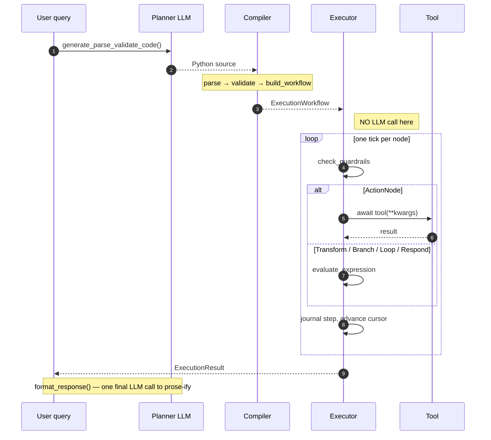

<Note>
ReAct loops invoke the model once per step to choose the next action. Astra's executor calls the LLM **zero times** during execution — every decision was baked into the graph at compile time.
</Note>

## The determinism guarantee

Once `Sandbox.build_dsl_workflow()` returns an `ExecutionWorkflow`, the model has done its job. `run_workflow()` ([workflow_executor.py:360](https://github.com/astra-dev/astra/blob/main/framework/src/framework/code_mode/executor/workflow_executor.py#L360)) walks that graph using:

- A **cursor** — the id of the node about to execute.
- A **state dict** — Python values for every variable the compiler discovered.
- A **journal** — an append-only list of `WorkflowStep` entries.
- Three lookup indices built once: `node_map` (id → node), `edge_index` (source → outgoing edges), and `loop_state` (loop id → iterator position).

For the same compiled graph and the same tool implementations, the visit order is byte-for-byte identical across runs. This is the property that makes replay, caching, and regression testing meaningful.

## The cursor model

Each iteration of the main loop is one tick. The cursor advances to exactly one node per tick:

<Steps>
  <Step title="Guardrail check">
    `check_guardrails()` ([workflow_executor.py:326](https://github.com/astra-dev/astra/blob/main/framework/src/framework/code_mode/executor/workflow_executor.py#L326)) bails out if wall-clock, total visits, or per-node visits exceed `WorkFlowConfig`.
  </Step>
  <Step title="Node dispatch">
    The current node's type selects a handler — `_execute_action`, `_execute_transform`, `_execute_branch`, `_execute_loop`, or `_execute_respond`.
  </Step>
  <Step title="Journal entry">
    A `WorkflowStep` is built with `node_id`, `type`, `label`, `status`, `duration_ms`, `inputs`, `outputs`, and `error`, then appended to `steps`.
  </Step>
  <Step title="Edge resolution">
    `find_next_node()` ([workflow_executor.py:269](https://github.com/astra-dev/astra/blob/main/framework/src/framework/code_mode/executor/workflow_executor.py#L269)) reads outgoing edges and picks the one matching the node's outcome.
  </Step>
  <Step title="Cursor advance">
    Cursor becomes the next node id, or `None` when a `RespondNode` halts the run.
  </Step>
</Steps>

## Node dispatch in detail

<Tabs>
  <Tab title="Action">
    `_execute_action()` ([workflow_executor.py:216](https://github.com/astra-dev/astra/blob/main/framework/src/framework/code_mode/executor/workflow_executor.py#L216)) resolves the `tool` key against the runtime tool map (with a case-insensitive fallback for capitalized identifiers), evaluates each input expression against state, and awaits the tool. If the tool is sync, it runs inline; if it is a coroutine, it is awaited directly. The result is written to `state[node.outputs["result"]]` when an output binding exists. Next edge: `SEQUENTIAL` or `LOOP_BACK`.
  </Tab>
  <Tab title="Transform">
    `_execute_transform()` ([workflow_executor.py:206](https://github.com/astra-dev/astra/blob/main/framework/src/framework/code_mode/executor/workflow_executor.py#L206)) evaluates `node.expression` via `evaluate_expression()` and writes to `state[node.assign_to]`. No tool, no IPC. Next edge: `SEQUENTIAL`.
  </Tab>
  <Tab title="Branch">
    `_execute_branch()` ([workflow_executor.py:196](https://github.com/astra-dev/astra/blob/main/framework/src/framework/code_mode/executor/workflow_executor.py#L196)) evaluates the condition expression to a bool. `find_next_node()` then picks `BRANCH_IF` when true, otherwise the matching `BRANCH_ELSE` or `BRANCH_DEFAULT`.
  </Tab>
  <Tab title="Loop">
    `_execute_loop()` ([workflow_executor.py:147](https://github.com/astra-dev/astra/blob/main/framework/src/framework/code_mode/executor/workflow_executor.py#L147)) is the only stateful dispatch. On first visit it materializes the collection and stores `(items, 0)` in `loop_state`; on each re-visit it advances the index. When the index reaches `len(items)` or `node.max_iterations`, the loop variable is popped from state and the cursor follows `SEQUENTIAL` to the post-loop node. Otherwise the current item is bound to `node.as_var` (with tuple-unpacking support) and the cursor follows `LOOP_BODY`.
  </Tab>
  <Tab title="Respond">
    `_execute_respond()` ([workflow_executor.py:201](https://github.com/astra-dev/astra/blob/main/framework/src/framework/code_mode/executor/workflow_executor.py#L201)) evaluates the message expression and assigns the result to the outer `response` variable. The main loop then `break`s — `find_next_node()` returns `None` for terminal nodes anyway.
  </Tab>
</Tabs>

### The safe expression evaluator

`evaluate_expression()` ([workflow_executor.py:120](https://github.com/astra-dev/astra/blob/main/framework/src/framework/code_mode/executor/workflow_executor.py#L120)) is a thin wrapper around `eval()` with two guarantees:

1. `__builtins__` is replaced with `{}` — `open`, `__import__`, and friends are unreachable.
2. The namespace is `{**SAFE_BUILTINS, **state}` — only the whitelisted pure functions plus the workflow's own state variables are in scope.

Because every expression originates from `ast.unparse()` of a validated AST, malformed input is impossible by the time we reach this point.

## State variables

`state: dict[str, Any]` is the single source of truth during a run. It is initialized empty and populated by:

- `_execute_transform` writing to `state[assign_to]`.
- `_execute_action` writing tool results to `state[outputs["result"]]`.
- `_execute_loop` binding the iteration variable.

Scope is flat — there are no closures, no nested namespaces. Determinism falls out for free: given identical tool results, the same node visited at the same cursor position observes the same state.

`state_size_limit_mb` (default 50) is a soft cap on the in-memory size of this dict. Large tool responses should be summarized into compact records before being assigned.

## Errors and bubble-up

Every node body is wrapped in a try/except that converts the exception into:

```python
step.status = "error"
step.error  = f"{type(exc).__name__}: {exc}"
```

The step is appended to the journal, the error is logged, and a sentinel `_NodeExecutionError` is raised inside the span context so the OpenTelemetry span records `status=error`. The outer handler ([workflow_executor.py:549](https://github.com/astra-dev/astra/blob/main/framework/src/framework/code_mode/executor/workflow_executor.py#L549)) catches the sentinel and returns an `ExecutionResult(success=False, ...)` with the partial journal intact. Errors never propagate as raw exceptions — they become structured data.

## Spans and observability

Every node tick opens a span. `ActionNode` ticks use `SpanKind.TOOL` with attributes like `tool_name`, `tool_qualified_name`, and `args_preview`. All other types use `SpanKind.STEP` with attributes like `node_id`, `node_type`, and `visit_index`. In debug mode the full input and output payloads are attached; otherwise truncated previews are used. See [workflow_executor.py:440](https://github.com/astra-dev/astra/blob/main/framework/src/framework/code_mode/executor/workflow_executor.py#L440) for the full attribute set.

## Sandbox.run() as the orchestrator

The public entry point in [sandbox.py:743](https://github.com/astra-dev/astra/blob/main/framework/src/framework/code_mode/sandbox.py#L743) wires the four stages together:



Steps 2 through `n-1` involve zero LLM calls. The model writes the plan once, and is consulted again only to convert the structured response into human-readable prose ([sandbox.py:810](https://github.com/astra-dev/astra/blob/main/framework/src/framework/code_mode/sandbox.py#L810)). Everything between is pure deterministic interpretation.

<Warning>
Tools themselves can be non-deterministic (a network call, a clock read). The executor is deterministic given identical tool outputs; reproducibility across runs requires tool-level idempotency or caching.
</Warning>

## See also

<CardGroup cols={2}>
  <Card title="Execution graph" icon="share-nodes" href="/compiler/execution-graph">
    The IR the executor consumes.
  </Card>
  <Card title="Replay" icon="clock-rotate-left" href="/compiler/replay">
    Re-running a workflow from its journal.
  </Card>
</CardGroup>
