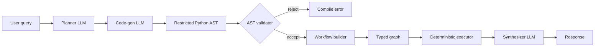

Astra is a **compiler**, not a loop. Most agent frameworks invoke the language model at every step inside a ReAct loop: the LLM picks a tool, sees the result, picks the next tool, and so on. Astra invokes the LLM exactly three times per query: once to plan, once to write a short Python program, and once to synthesize the final answer. Everything between those calls is deterministic Python running over a typed graph.

## The three LLM calls

<Steps>
  <Step title="Planner">
    The planner LLM receives the user query, the team's instructions, and a compact description of every agent and tool ([`get_planner_context`](https://github.com/astra-dev/astra/blob/main/astra/framework/src/framework/code_mode/semantic.py#L286)). It produces a short natural-language plan that names the agents to involve and the order of operations. No code yet, no tool calls. This call is cheap because the prompt holds only roles and tool slugs.
  </Step>
  <Step title="Code generator">
    The second LLM call is given the plan plus the full **semantic layer**: type-hinted Python stubs for every tool, including parameter descriptions, return field schemas, and few-shot examples. It writes a small Python program that calls those stubs in the correct order. The program is the workflow. See [stub_generator.py](https://github.com/astra-dev/astra/blob/main/astra/framework/src/framework/code_mode/stub_generator.py) and [`AGENT_CODE_MODE_PROMPT`](https://github.com/astra-dev/astra/blob/main/astra/framework/src/framework/code_mode/prompts.py).
  </Step>
  <Step title="Synthesizer">
    Once the graph finishes, a third LLM call shapes the raw execution output into the final user-facing response. By this point all tool calls are done, so the prompt only carries the structured result. See [`format_response`](https://github.com/astra-dev/astra/blob/main/astra/framework/src/framework/code_mode/sandbox.py).
  </Step>
</Steps>

The number of LLM calls is fixed at three regardless of how many tools the workflow calls. Token cost stops growing with the number of steps; it only grows with the size of the plan.

## The pipeline



Once the code generator emits Python, Astra never executes it as a script. The text is parsed into a `ast.Module`, walked by the [AST validator](https://github.com/astra-dev/astra/blob/main/astra/framework/src/framework/code_mode/compiler/ast_parser.py), then lowered into an [`ExecutionWorkflow`](https://github.com/astra-dev/astra/blob/main/astra/framework/src/framework/code_mode/compiler/workflow_builder.py#L64) by `build_workflow()`. The result is a graph of nodes and edges, not a Python script.

```python
@dataclass
class ExecutionWorkflow:
    name: str = ""
    description: str = ""
    entry: str = ""
    nodes: list[Node] = field(default_factory=list)
    edges: list[Edge] = field(default_factory=list)
    state_variables: list[str] = field(default_factory=list)
    config: WorkFlowConfig = field(default_factory=WorkFlowConfig)
```

## Five node types

Every statement in the generated code lowers to exactly one of five node kinds in [compiler/nodes.py](https://github.com/astra-dev/astra/blob/main/astra/framework/src/framework/code_mode/compiler/nodes.py):

<CardGroup cols={2}>
  <Card title="ActionNode" icon="bolt">
    Calls a tool. The qualified name `{agent_id}.{tool_slug}` is resolved at execution time against the runtime tool map. Inputs are captured as expression strings, not evaluated yet.
  </Card>
  <Card title="TransformNode" icon="arrow-right-arrow-left">
    Pure Python expression over state variables. Examples: assignments, dictionary lookups, list comprehensions, arithmetic. No tools, no I/O.
  </Card>
  <Card title="RespondNode" icon="reply">
    Terminal node calling `synthesize_response(...)`. Marks the workflow as finished and ships the payload to the synthesizer LLM.
  </Card>
  <Card title="BranchNode" icon="code-branch">
    `if` / `elif` / `else` — the executor evaluates the predicate over current state and follows the matching outgoing edge.
  </Card>
  <Card title="LoopNode" icon="rotate">
    `for x in iterable: ...` — the executor binds the loop variable on each iteration and re-enters the loop body subgraph.
  </Card>
</CardGroup>

## Sandbox execution

The compiled graph is handed to the executor at [code_mode/executor/](https://github.com/astra-dev/astra/blob/main/astra/framework/src/framework/code_mode/executor) via [`Sandbox.execute_dsl`](https://github.com/astra-dev/astra/blob/main/astra/framework/src/framework/code_mode/sandbox.py#L148). The runner is a cursor over the graph: it visits nodes in topological order, evaluates transforms in a restricted namespace, dispatches actions to the tool registry, and short-circuits at the first respond node. Execution makes **zero LLM calls** — the model has already done its work in the code-gen phase.

<Tip>
Because the graph is data, you can introspect it before any tool runs. `dsl_workflow.summary()` returns the full plan as JSON: every node, every edge, every state variable. Use this to audit, log, or visualize the workflow before letting it loose on production tools.
</Tip>

<Warning>
Astra does not replan mid-execution. If a tool returns a value that should change which downstream tool is called, that branching has to be expressible at compile time (a `BranchNode` over the tool result). For genuinely adaptive workflows where the next step is unknowable until earlier results land, a ReAct loop still has the edge.
</Warning>

<CardGroup cols={2}>
  <Card title="Why compile, not loop?" icon="code-compare" href="/concepts/why-compile-not-loop">
    The tradeoffs versus ReAct, with benchmark numbers.
  </Card>
  <Card title="Agents" icon="robot" href="/concepts/agents">
    The Agent primitive and its lifecycle.
  </Card>
</CardGroup>
