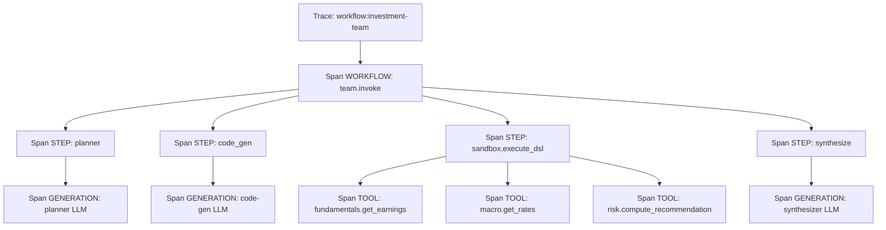

Astra observability is a separate PyPI package (`astra-observability`) that the framework wires into every important boundary: planner calls, code generation, tool dispatches, middleware runs, persistence writes. The result is a tree of spans under a single trace per user request, with token usage attributed to the exact LLM call that incurred it.

## The three pillars

<CardGroup cols={3}>
  <Card title="Traces" icon="route">
    One per user request. Root container for everything that happens during a single `invoke` or `stream` call.
  </Card>
  <Card title="Spans" icon="timeline">
    Operations within a trace. Spans nest — a `WORKFLOW` span contains `STEP` spans contains `GENERATION` and `TOOL` spans.
  </Card>
  <Card title="Logs" icon="file-lines">
    Structured log records attached to a span. Carry levels, messages, and optional attribute dicts.
  </Card>
</CardGroup>

## The engine

`ObservabilityEngine` ([engine.py:25](https://github.com/astra-dev/astra/blob/main/astra/observability/src/observability/engine.py#L25)) orchestrates lifecycle. It owns:

- A `StorageBackend` for persistence.
- An in-memory registry of active (in-flight) traces and spans.
- A `ConsoleDebugger` for real-time terminal output when `debug_mode=True`.

You construct one at process startup and register it with `observability.init(engine)`. After that, the public API in [observability/instrument.py](https://github.com/astra-dev/astra/blob/main/astra/observability/src/observability/instrument.py) (`trace`, `span`, `log`, `update_span`) routes everything through the registered engine.

```python
from observability import init, ObservabilityEngine
from observability.storage.libsql import LibSQLBackend

engine = ObservabilityEngine(
    storage=LibSQLBackend(url="file:./astra.db"),
    debug_mode=True,
)
init(engine)
```

The framework picks up the registered engine automatically. You do not pass the engine to agents or teams — they look it up via the public API.

## Trace

`Trace` ([tracing/trace.py:33](https://github.com/astra-dev/astra/blob/main/astra/observability/src/observability/tracing/trace.py#L33)) is a Pydantic model.

<ParamField path="trace_id" type="str">
  Unique identifier (UUID4). Returned by `start_trace` so the caller can correlate.
</ParamField>

<ParamField path="name" type="str">
  Human-readable name. Typically `"workflow:<team-or-agent-name>"`.
</ParamField>

<ParamField path="status" type="TraceStatus">
  `RUNNING`, `SUCCESS`, or `ERROR`.
</ParamField>

<ParamField path="total_tokens" type="int">
  Aggregated across all spans when the trace ends.
</ParamField>

<ParamField path="input_tokens" type="int">
  Prompt tokens summed across every generation span.
</ParamField>

<ParamField path="output_tokens" type="int">
  Completion tokens summed across every generation span.
</ParamField>

<ParamField path="thoughts_tokens" type="int">
  Thinking-process tokens (Gemini's `thoughts_token_count` or equivalent on other providers).
</ParamField>

<ParamField path="model" type="str | None">
  The primary model used, or `"multiple"` if more than one was involved.
</ParamField>

## Span and SpanKind

`Span` ([tracing/span.py:38](https://github.com/astra-dev/astra/blob/main/astra/observability/src/observability/tracing/span.py#L38)) carries hierarchy via `parent_span_id`. The `kind` field categorizes the operation:

| `SpanKind`   | Used for                                                              |
| ------------ | --------------------------------------------------------------------- |
| `WORKFLOW`   | Top-level agent or team execution                                     |
| `STEP`       | Pipeline phases: planner, code-gen, sandbox build, executor, response |
| `GENERATION` | A single LLM call. Carries input/output/thoughts token counts.        |
| `TOOL`       | A single tool dispatch from an `ActionNode`.                          |

Spans transition through `RUNNING -> SUCCESS` (or `ERROR`) via `Span.end(...)`. The `duration_ms` is computed at end time from `end_time - start_time`.

## Trace tree



For a workflow with 12 tool calls, you get one trace, ~4 step spans, 3 generation spans, and 12 tool spans. The fixed three-LLM-call invariant is right there in the data — the trace **always** has exactly three generation spans.

## Logs

`log(level, message, attributes=None)` writes a `Log` record bound to the current span. Levels are the standard set: `DEBUG`, `INFO`, `WARN`, `ERROR`. Logs follow spans through the registry, so you query "all logs in this trace" or "all error logs in the last hour" via the storage backend.

```python
from observability import log, LogLevel

await log(LogLevel.INFO, "Loaded 12 documents from knowledge base", {"count": 12})
```

## Using spans in your own code

Wrap your own work in spans to make them appear in the same trace tree:

```python
from observability import span, SpanKind

async with span("my_custom_step", kind=SpanKind.STEP, attributes={"region": "us-east"}):
    result = await do_expensive_work()
    await log(LogLevel.INFO, "Done", {"rows": len(result)})
```

`update_span(attributes={...})` mutates the active span's attributes mid-execution — useful when you only know the final attribute values partway through the span.

<Tip>
For local development, set `debug_mode=True` on the engine and the `ConsoleDebugger` prints every span open/close, log line, and token count to stdout in real time. For production, leave it off and read from the storage backend instead.
</Tip>

<Note>
The framework also exposes `is_debug_mode()` and `preview()` helpers via `observability.debug` for emitting human-readable snapshots of large objects (truncated, redacted) into spans without bloating storage.
</Note>

<CardGroup cols={2}>
  <Card title="Architecture" icon="diagram-project" href="/concepts/architecture">
    The compiler pipeline that observability instruments.
  </Card>
  <Card title="Why compile, not loop?" icon="code-compare" href="/concepts/why-compile-not-loop">
    Why traces always have exactly three generation spans.
  </Card>
</CardGroup>
