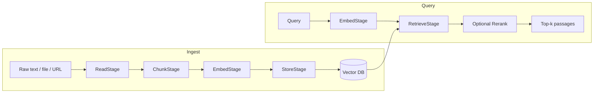

Astra ships a RAG pipeline that bolts cleanly onto any agent. The pipeline is stage-based, the embedder and vector DB are pluggable, and from the agent's perspective the result is a single auto-generated tool: `retrieve_evidence`.

## The shape

A `Rag` instance is two pipelines sharing one context. The **ingest pipeline** turns raw documents into indexed chunks; the **query pipeline** turns a question into ranked passages.



The pipeline is defined in [rag/pipeline.py](https://github.com/astra-dev/astra/blob/main/astra/framework/src/framework/rag/pipeline.py); stages live in [rag/stages/](https://github.com/astra-dev/astra/tree/main/astra/framework/src/framework/rag/stages).

## Components

<CardGroup cols={2}>
  <Card title="RagContext" icon="folder-tree">
    Shared dependencies passed to every stage: the embedder, the vector DB, the chunker. Source: [rag/context.py](https://github.com/astra-dev/astra/blob/main/astra/framework/src/framework/rag/context.py).
  </Card>
  <Card title="StageState" icon="layer-group">
    Mutable per-execution state. Each stage reads inputs from it and writes outputs back, so the next stage can read them.
  </Card>
  <Card title="Pipeline" icon="diagram-project">
    Wraps an ordered list of stages and executes them sequentially under a single trace span.
  </Card>
  <Card title="Rag" icon="brain">
    High-level orchestrator. Owns the ingest pipeline, the query pipeline, and the shared context. This is what you hand to `Agent(rag_pipeline=...)`.
  </Card>
</CardGroup>

## Embedders

The framework ships three embedders, all sharing the base interface in [rag/embedders/base.py](https://github.com/astra-dev/astra/blob/main/astra/framework/src/framework/rag/embedders/base.py):

<CodeGroup>

```python HuggingFace (local)
from framework.rag.embedders import HuggingFaceEmbedder

embedder = HuggingFaceEmbedder(
    model="sentence-transformers/all-MiniLM-L6-v2",
)
```

```python Gemini
from framework.rag.embedders import GeminiEmbedder

embedder = GeminiEmbedder(model="text-embedding-004")
```

```python OpenAI
from framework.rag.embedders import OpenAIEmbedder

embedder = OpenAIEmbedder(model="text-embedding-3-small")
```

</CodeGroup>

HuggingFace runs in-process; Gemini and OpenAI hit the provider's hosted embedding endpoints.

## Vector DB and chunking

The default vector backend is `LanceDB` ([rag/vectordb/lancedb.py](https://github.com/astra-dev/astra/blob/main/astra/framework/src/framework/rag/vectordb/lancedb.py)) — file-backed, no server, fine for development and small production loads. The base class at [rag/vectordb/base.py](https://github.com/astra-dev/astra/blob/main/astra/framework/src/framework/rag/vectordb/base.py) is the contract any backend implements.

Chunking defaults to `RecursiveChunking` ([rag/chunking/recursive.py](https://github.com/astra-dev/astra/blob/main/astra/framework/src/framework/rag/chunking/recursive.py)), which recursively splits on paragraph, sentence, and word boundaries until chunks fit the configured token budget.

## Wiring it together

```python
from framework.agents import Agent
from framework.models.google import Gemini
from framework.rag import Rag
from framework.rag.context import RagContext
from framework.rag.embedders import HuggingFaceEmbedder
from framework.rag.vectordb import LanceDB
from framework.rag.chunking import RecursiveChunking
from framework.rag.pipeline import Pipeline
from framework.rag.stages import ReadStage, ChunkStage, EmbedStage, StoreStage, RetrieveStage

context = RagContext(
    embedder=HuggingFaceEmbedder(model="sentence-transformers/all-MiniLM-L6-v2"),
    vector_db=LanceDB(uri="./kb"),
    chunker=RecursiveChunking(chunk_size=512, chunk_overlap=64),
)

rag = Rag(
    context=context,
    ingest_pipeline=Pipeline("ingest", stages=[ReadStage(), ChunkStage(), EmbedStage(), StoreStage()]),
    query_pipeline=Pipeline("query", stages=[EmbedStage(), RetrieveStage(top_k=5)]),
    max_results=5,
)

agent = Agent(
    name="Researcher",
    model=Gemini("gemini-2.5-flash"),
    instructions="Cite the knowledge base for every factual claim.",
    rag_pipeline=rag,
)

await agent.ingest(path="./docs/handbook.md", name="Handbook")
response = await agent.invoke("What's our remote-work policy?")
```

## The retrieve_evidence tool

When an agent is constructed with `rag_pipeline=...`, [`_create_retrieve_evidence_tool`](https://github.com/astra-dev/astra/blob/main/astra/framework/src/framework/agents/agent.py#L264) auto-generates a tool the planner can call:

```python
class researcher:
    @staticmethod
    def retrieve_evidence(input: RetrieveEvidenceInput) -> RetrieveEvidenceOutput:
        """Retrieve evidence from the knowledge base to support reasoning."""
        ...
```

The tool is a normal tool. The planner picks it like any other, the code-gen LLM writes a call into the Python program, and the typed graph executes it as an `ActionNode`. From the workflow's perspective there is no separate "RAG step" — retrieval is one tool call among many.

<Tip>
Astra exposes convenience passthroughs on `Agent`: `await agent.ingest(text=...)`, `await agent.ingest_batch([...])`, `await agent.ingest_directory("./docs", pattern="*.md")`. They forward straight to the `rag_pipeline` so you don't need to keep a separate reference around.
</Tip>

<Warning>
The auto-generated tool's `max_results` is clamped to `rag_pipeline.max_results`. If the LLM asks for `limit=100` and your pipeline caps at 5, it will get 5 — silently. Set `max_results` deliberately when constructing the `Rag` instance.
</Warning>

<CardGroup cols={2}>
  <Card title="MCP" icon="plug" href="/concepts/mcp">
    Model Context Protocol toolkits.
  </Card>
  <Card title="Middleware" icon="filter" href="/concepts/middleware">
    Input/output processing pipeline.
  </Card>
</CardGroup>
