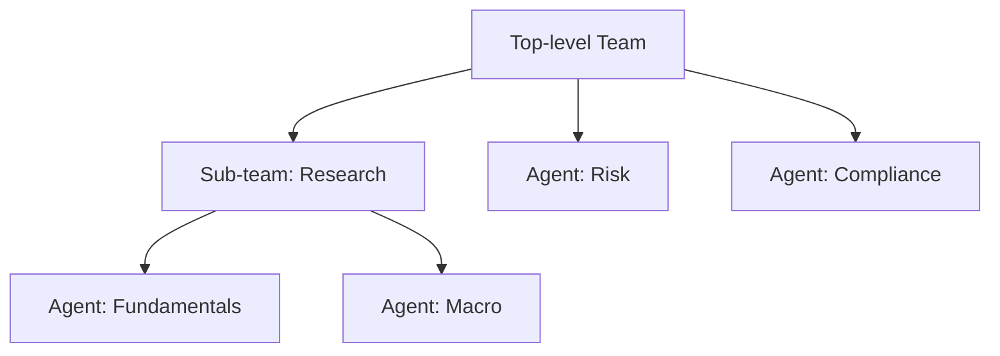

A `Team` coordinates multiple agents (and optionally nested teams) under a single planner. The team's instructions describe **how** the agents should collaborate; the planner LLM uses those instructions plus the merged semantic layer to generate one Python program that calls tools across every member.

```python
from framework.team import Team
from framework.models.google import Gemini

team = Team(
    id="investment-team",
    name="Investment Committee",
    description="Generates a buy/hold/sell recommendation.",
    model=Gemini("gemini-2.5-flash"),
    members=[fundamentals_agent, macro_agent, risk_agent],
    instructions="""
        1. Fundamentals analyst pulls earnings and balance sheet.
        2. Macro analyst pulls rates and sector view.
        3. Risk analyst synthesizes both into a recommendation.
    """,
)

decision = await team.invoke("Should we hold AAPL through Q3?")
```

## Constructor

The signature is at [team.py:125-196](https://github.com/astra-dev/astra/blob/main/astra/framework/src/framework/team/team.py#L125).

<ParamField path="id" type="str | None" required={true}>
  Stable team identifier. Pass `None` to derive `team-<slug>` from `name`.
</ParamField>

<ParamField path="name" type="str" required={true}>
  Human-readable team name. Surfaced in observability and the playground UI.
</ParamField>

<ParamField path="description" type="str" required={true}>
  Short summary of the team's purpose. Included in the planner context.
</ParamField>

<ParamField path="model" type="Model" required={true}>
  Model used for all three LLM calls (plan, code-gen, synthesize).
</ParamField>

<ParamField path="members" type="list[Agent | Team | TeamMember]" required={true}>
  The team's members. Raw `Agent` and `Team` instances are auto-wrapped in `TeamMember`. Use `TeamMember` directly when you need to override the display name or id.
</ParamField>

<ParamField path="instructions" type="str" required={true}>
  Keyword-only. The collaboration protocol. Treat this like a runbook the planner will follow.
</ParamField>

<ParamField path="storage" type="StorageClient | None" required={false} default="None">
  Persistence backend for the team thread.
</ParamField>

<ParamField path="memory" type="Memory | None" required={false} default="Memory()">
  Conversation memory configuration for the team thread.
</ParamField>

<ParamField path="timeout" type="float" required={false} default="300.0">
  Maximum execution time in seconds for one `invoke` call.
</ParamField>

<ParamField path="max_retries" type="int" required={false} default="2">
  Retry budget for transient failures.
</ParamField>

<ParamField path="middlewares" type="list[Middleware] | None" required={false} default="None">
  Team-level input/output middlewares. Run before/after the per-agent middlewares.
</ParamField>

<ParamField path="metadata" type="dict[str, Any] | None" required={false} default="None">
  Arbitrary metadata attached to the team. Surfaced in observability spans.
</ParamField>

## TeamMember

`TeamMember` ([team.py:56](https://github.com/astra-dev/astra/blob/main/astra/framework/src/framework/team/team.py#L56)) is a dataclass wrapper that holds the agent (or nested team) plus optional display overrides:

```python
from framework.team import TeamMember

member = TeamMember(
    agent=risk_agent,
    name="Risk",                       # override agent.name for display
    id="risk-2",                       # stable id across renames
    description="Final recommender",   # override agent.description
)
```

Member ids must be unique within a team. Astra raises `ValueError` at construction time if duplicates are detected.

## Nested teams and flat_members

Teams compose. A team's `members` may contain other teams, which themselves contain agents (or further nested teams). The [`flat_members`](https://github.com/astra-dev/astra/blob/main/astra/framework/src/framework/team/team.py#L366) property recursively flattens that tree into a list of `TeamMember` whose `agent` is always an `Agent`, never a `Team`.



For the tree above, `top_team.flat_members` returns `[Fundamentals, Macro, Risk, Compliance]`. The sandbox uses this to build the tool map; the semantic layer uses it (with the original tree preserved) to emit nested Python classes the planner can reference as `top_team.research.fundamentals.get_earnings(...)`.

## Execution methods

<AccordionGroup>
  <Accordion title="invoke(query, *, thread_id=None, timeout=None, context=None)">
    Runs the full pipeline: input middlewares, plan, code-gen, sandbox execution, synthesize, output middlewares, persist. Returns the final response string. Source: [team.py:406](https://github.com/astra-dev/astra/blob/main/astra/framework/src/framework/team/team.py#L406).
  </Accordion>
  <Accordion title="stream(query, *, thread_id=None, timeout=None, context=None)">
    Same pipeline as `invoke`, yielding `StreamEvent` objects so a UI can show progress through plan, code-gen, per-tool execution, and the final synthesis. Source: [team.py:482](https://github.com/astra-dev/astra/blob/main/astra/framework/src/framework/team/team.py#L482).
  </Accordion>
</AccordionGroup>

## Errors

All team-level errors derive from `TeamError` ([team.py:40](https://github.com/astra-dev/astra/blob/main/astra/framework/src/framework/team/team.py#L40)):

<CardGroup cols={2}>
  <Card title="TeamError" icon="circle-exclamation">
    Base class. Catch this if you want to handle any team failure uniformly.
  </Card>
  <Card title="DelegationError" icon="user-xmark">
    Raised when delegation to a member fails inside the sandbox.
  </Card>
  <Card title="MemberNotFoundError" icon="user-slash">
    The planner referenced an agent id that doesn't exist on the team.
  </Card>
  <Card title="TeamTimeoutError" icon="hourglass-end">
    Total execution exceeded the team `timeout` (default 300s).
  </Card>
</CardGroup>

<Tip>
Team-level middlewares wrap the entire workflow, while agent-level middlewares fire on each per-agent invocation inside the sandbox. If you need a single PII scrub on the user's query, attach it to the team; if you need it per agent (because different agents have different output formats), attach it on the agent.
</Tip>

<CardGroup cols={2}>
  <Card title="Tools" icon="screwdriver-wrench" href="/concepts/tools">
    Defining the tools your agents expose.
  </Card>
  <Card title="Semantic Layer" icon="layer-group" href="/concepts/semantic-layer">
    The typed schema the planner LLM sees.
  </Card>
</CardGroup>
