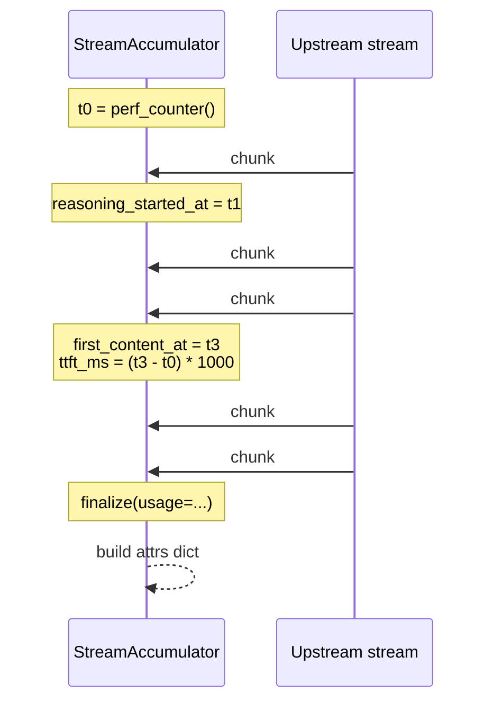

`StreamAccumulator` is the helper every streaming model adapter uses to record per-call metrics. It buckets each yielded chunk into `content`, `tool_call`, or `reasoning`, snapshots the first-content timestamp for TTFT, and produces a flat attribute dict that can be handed straight to `update_span()`. The result is that every `GENERATION` span carries enough metadata for the dashboard to render TTFT distributions, content-vs-reasoning split, and chunk throughput without re-reading raw chunks.

Source: [streaming/accumulator.py:36](https://github.com/astra-dev/astra/blob/main/astra/observability/src/observability/streaming/accumulator.py#L36).

## Lifecycle

<Steps>
  <Step title="Construct one accumulator per generation">
    `acc = StreamAccumulator()` starts a wall-clock timer (`time.perf_counter()`). Allocate it inside the `GENERATION` span so its lifetime matches the span's.
  </Step>
  <Step title="Call observe_chunk(chunk) for every yielded chunk">
    The accumulator inspects `chunk.content`, `chunk.tool_calls`, and `chunk.metadata` (or the dict equivalents) and updates counters and timestamps. Content chunks pin `_first_content_at` on the first arrival; tool-call chunks pin `_first_tool_at`. Reasoning chunks are detected by `metadata.reasoning` or `metadata.is_reasoning`.
  </Step>
  <Step title="Call finalize(usage=...) when the stream ends">
    Returns a flat dict of attributes. Pass it to `update_span(attrs)` so the values are persisted with the closing span.
  </Step>
</Steps>

## What gets tracked

<AccordionGroup>
  <Accordion title="Counters" icon="hashtag">
    - `chunk_count` — total chunks observed
    - `content_chunks` — chunks with non-empty `content` and no reasoning flag
    - `tool_call_chunks` — chunks carrying `tool_calls`
    - `reasoning_chunks` — chunks tagged as reasoning
    - `content_chars` — sum of `len(content)` across content chunks
    - `reasoning_chars` — sum of `len(content)` across reasoning chunks
  </Accordion>
  <Accordion title="Timings" icon="clock">
    - `ttft_ms` — milliseconds from accumulator construction to the first content or tool-call chunk
    - `total_duration_ms` — milliseconds across the whole stream
    - `reasoning_duration_ms` — from the first reasoning chunk to the last
    - `generation_duration_ms` — from the first content chunk to stream end
  </Accordion>
  <Accordion title="Optional fields" icon="plus">
    - `model`, `provider` — strings passed to `finalize()`
    - `input_tokens`, `output_tokens`, `thoughts_tokens`, `total_tokens` — copied from the provider's `usage` dict when supplied
    - `chunks_raw_preview` — only when `include_raw=True`; up to 5 truncated sample chunks for debugging
  </Accordion>
</AccordionGroup>

`ttft_ms` is `None` when neither a content chunk nor a tool-call chunk ever arrived (for example, a stream that errored before yielding anything). Treat that as "no signal", not as zero, when computing dashboard percentiles.

## Stream timeline



## Usage inside a model adapter

```python
from observability import span, update_span
from observability.tracing.span import SpanKind
from observability.streaming.accumulator import StreamAccumulator

async def stream(self, prompt: str):
    async with span(
        "generation.openai.stream",
        kind=SpanKind.GENERATION,
        attributes={"model": self.model, "provider": "openai"},
    ):
        acc = StreamAccumulator()
        last_usage = None

        async for chunk in self._upstream_call(prompt):
            acc.observe_chunk(chunk)
            if chunk.usage:
                last_usage = chunk.usage
            yield chunk

        update_span(acc.finalize(
            usage=last_usage,
            model=self.model,
            provider="openai",
        ))
```

The span's `attributes` end up on disk via `ObservabilityEngine.end_span`, which also reads `total_tokens`, `input_tokens`, `output_tokens`, `thoughts_tokens`, and `model` to roll them up onto the parent trace.

## How metrics consume this

The metrics aggregator walks every `GENERATION` span:

- Pulls `ttft_ms` from each span's attributes and averages them into `avg_ttft_ms`.
- Computes percentiles over each span's `duration_ms` to produce `generation_p50_ms` and `generation_p95_ms`.

See [metrics](/observability/metrics) for the full snapshot shape.

<Tip>
Use `include_raw=True` only in debug builds. The raw preview is helpful when a model returns malformed deltas, but it inflates the spans table and shows up in `/observability/traces/<id>` payloads sent to the browser.
</Tip>

<Warning>
`StreamAccumulator` uses `time.perf_counter()`, which is monotonic but not wall-clock. Do not compare its derived timestamps against `Span.start_time`. The accumulator only owns durations; absolute times come from the engine.
</Warning>

## Detecting reasoning chunks

The accumulator looks at `chunk.metadata.reasoning` or `chunk.metadata.is_reasoning`. Provider adapters set this flag for Gemini "thoughts" deltas, OpenAI o-series reasoning deltas, or any chain-of-thought stream the user should not see verbatim. If your custom adapter exposes reasoning content under a different shape, normalise it into `metadata` before yielding the chunk.

<CardGroup cols={2}>
  <Card title="Traces and spans" icon="chart-network" href="/observability/traces-and-spans">
    Where the accumulator's output lands on disk.
  </Card>
  <Card title="Metrics" icon="chart-line" href="/observability/metrics">
    `avg_ttft_ms` and `generation_p95_ms` consumers.
  </Card>
</CardGroup>
