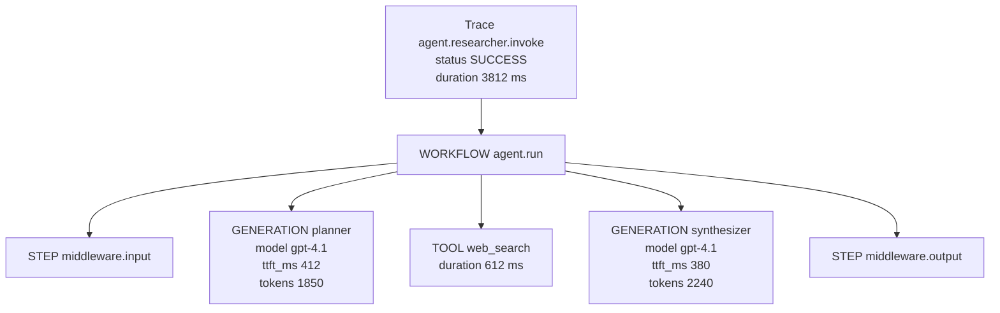

A `Trace` represents one user request flowing through Astra: a call to `POST /agents/{id}/invoke`, a workflow run, a team turn. Each trace is a tree of `Span` objects, where every span is a single observable operation (a model generation, a tool call, a workflow step). Token usage and model identity bubble up from `GENERATION` spans onto the trace when the trace ends, so a single dashboard row can show total tokens without a separate aggregation pass.

Source: [tracing/trace.py:33](https://github.com/astra-dev/astra/blob/main/astra/observability/src/observability/tracing/trace.py#L33), [tracing/span.py:38](https://github.com/astra-dev/astra/blob/main/astra/observability/src/observability/tracing/span.py#L38).

## Trace

<ResponseField name="trace_id" type="string">UUID4. Generated at construction; persists through the trace's lifetime.</ResponseField>
<ResponseField name="name" type="string">Human-readable label, e.g. `"agent.researcher.invoke"`.</ResponseField>
<ResponseField name="status" type="TraceStatus">`RUNNING`, `SUCCESS`, or `ERROR`.</ResponseField>
<ResponseField name="start_time" type="datetime">Timezone-aware UTC. Serializes with `+00:00` so browsers parse it correctly.</ResponseField>
<ResponseField name="end_time" type="datetime | null">Set by `Trace.end()` when the context manager exits.</ResponseField>
<ResponseField name="attributes" type="object">Free-form metadata. The runtime routes stamp `agent_id`, `team_id`, `thread_id`, `user_query` (truncated to 100 chars), and `operation` here.</ResponseField>
<ResponseField name="total_tokens" type="integer">Sum across all child generation spans.</ResponseField>
<ResponseField name="input_tokens" type="integer">Prompt tokens.</ResponseField>
<ResponseField name="output_tokens" type="integer">Completion tokens.</ResponseField>
<ResponseField name="thoughts_tokens" type="integer">Hidden reasoning tokens (Gemini thoughts, OpenAI o-series reasoning).</ResponseField>
<ResponseField name="model" type="string | null">First model seen, or `"multiple"` if the trace used more than one.</ResponseField>
<ResponseField name="duration_ms" type="integer | null">Computed field. `int((end_time - start_time).total_seconds() * 1000)`.</ResponseField>

Trace lifecycle: `Trace()` enters `RUNNING`. `Trace.end(status)` flips the status, stamps `end_time`, and lets `duration_ms` resolve. `Trace.add_token_usage(...)` is called by `ObservabilityEngine.end_span` for every closed `GENERATION` span.

## Span

<ResponseField name="span_id" type="string">UUID4.</ResponseField>
<ResponseField name="trace_id" type="string">Owning trace.</ResponseField>
<ResponseField name="parent_span_id" type="string | null">`None` for root spans.</ResponseField>
<ResponseField name="name" type="string">Span label, e.g. `"middleware.input"`, `"tool.web_search"`.</ResponseField>
<ResponseField name="kind" type="SpanKind">`WORKFLOW`, `STEP`, `GENERATION`, or `TOOL`.</ResponseField>
<ResponseField name="status" type="SpanStatus">`RUNNING`, `SUCCESS`, or `ERROR`.</ResponseField>
<ResponseField name="start_time" type="datetime">UTC, tz-aware.</ResponseField>
<ResponseField name="end_time" type="datetime | null">Set on `span.end()`.</ResponseField>
<ResponseField name="duration_ms" type="integer | null">Stored, not computed: `Span.end()` writes it before persistence.</ResponseField>
<ResponseField name="attributes" type="object">Streaming metrics, tool args, model name, token usage. `GENERATION` spans typically carry `model`, `provider`, `ttft_ms`, `chunk_count`, `input_tokens`, `output_tokens`, `total_tokens`, `thoughts_tokens`.</ResponseField>
<ResponseField name="error" type="string | null">Populated when status is `ERROR`.</ResponseField>

## SpanKind taxonomy

<AccordionGroup>
  <Accordion title="WORKFLOW" icon="diagram-project">
    Top-level orchestration. Used for full team turns and multi-step workflows. There is at most one `WORKFLOW` span per trace, and it is the parent of everything else.
  </Accordion>
  <Accordion title="STEP" icon="list-check">
    A discrete step inside a workflow: middleware, planning, routing. The default kind for `span(...)` calls that do not specify one.
  </Accordion>
  <Accordion title="GENERATION" icon="brain">
    An LLM call. Attributes carry tokens, model, provider, and streaming metrics. `ObservabilityEngine.end_span` reads these to bubble token usage onto the parent trace.
  </Accordion>
  <Accordion title="TOOL" icon="wrench">
    A tool execution. Attributes typically include `tool_name`, `tool_arguments`, `result_preview`, and `is_error`. The metrics aggregator counts these and tracks per-tool error rates.
  </Accordion>
</AccordionGroup>

## A sample trace tree



The trace's `total_tokens` is `1850 + 2240 = 4090`. Because both generations used `gpt-4.1`, `trace.model == "gpt-4.1"`. If the synthesizer had used a different model, `trace.model` would flip to `"multiple"`.

## Reading traces

Use the query helpers from [querying](/observability/querying):

```python
from observability import list_traces, get_trace_with_spans

traces = await list_traces(engine.storage, limit=20)
for t in traces:
    print(t.trace_id, t.name, t.status, t.duration_ms, t.total_tokens)

detail = await get_trace_with_spans(engine.storage, traces[0].trace_id)
for s in detail.spans:
    indent = "  " if s.parent_span_id else ""
    print(f"{indent}{s.kind} {s.name} {s.duration_ms}ms status={s.status}")
```

<Tip>
Always print `duration_ms` from the trace, not from a computed `end_time - start_time` on the client. The model's `duration_ms` is what dashboards and percentile calculations consume; staying consistent avoids rounding drift.
</Tip>

<Warning>
`Span.duration_ms` is `None` while a span is `RUNNING`. If you query the engine mid-flight (an in-flight trace shows up in `/observability/traces` with `status: RUNNING`), filter those out before aggregating, or you will skew p95 numbers.
</Warning>

## System traces

The query layer hides traces whose names start with `server.` (`SYSTEM_TRACE_PREFIXES`). These are operational traces like `server.startup` and exist so the engine can record its own bootstrap. Set `include_system=true` on `/observability/traces` or `/observability/metrics` to see them.

<CardGroup cols={2}>
  <Card title="Metrics" icon="chart-line" href="/observability/metrics">
    Aggregated view computed from the trace tree.
  </Card>
  <Card title="Querying" icon="magnifying-glass" href="/observability/querying">
    REST and Python APIs for fetching traces and spans.
  </Card>
</CardGroup>
