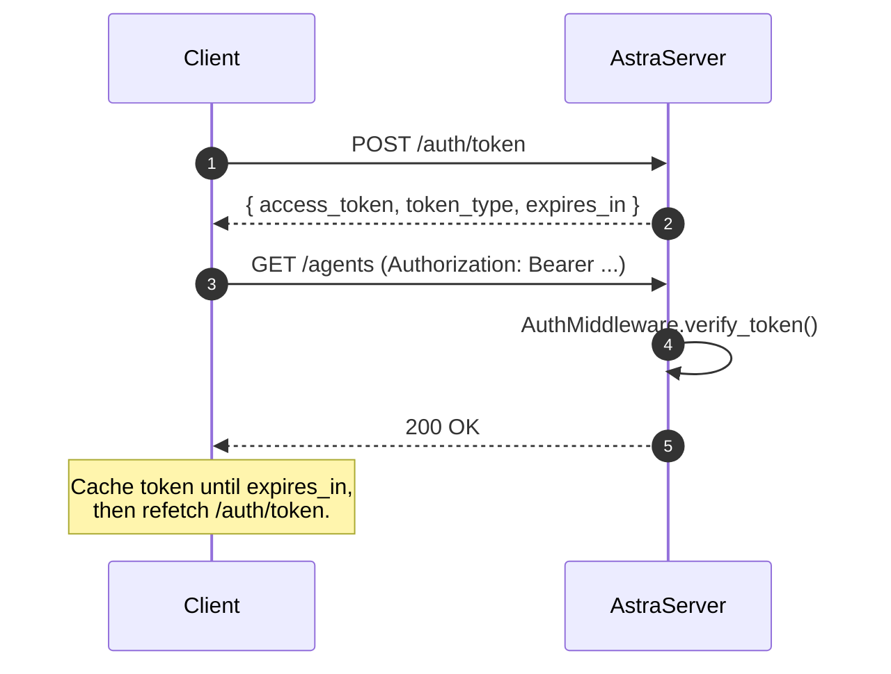

AstraServer ships a thin JWT layer: a `POST /auth/token` endpoint mints HS256 tokens, and a Starlette middleware validates them on every non-public path. There is no user model and no refresh flow; tokens are short-lived bearer credentials suitable for an internal playground or a trusted SDK. For multi-tenant deployments, wrap Astra with an external identity provider.

## Environment

| Variable | Required | Default | Purpose |
| --- | --- | --- | --- |
| `ASTRA_JWT_SECRET` | yes (when `auth_enabled=True`) | unset | HS256 signing key. |
| `ASTRA_JWT_EXPIRY_HOURS` | no | `24` | Token lifetime. |

If `ASTRA_JWT_SECRET` is unset, `AstraServer.auth_enabled` evaluates to `False` even when the flag is passed as `True`. See [server.py:138](https://github.com/astra-dev/astra/blob/main/astra/runtime/src/runtime/server.py#L138).

## JWT primitives

Defined in [auth/jwt.py](https://github.com/astra-dev/astra/blob/main/astra/runtime/src/runtime/auth/jwt.py).

<AccordionGroup>
  <Accordion title="get_jwt_secret() -> str | None" icon="key">
    Reads `ASTRA_JWT_SECRET`. Returns `None` if absent.
  </Accordion>
  <Accordion title="get_jwt_expiry_hours() -> int" icon="clock">
    Reads `ASTRA_JWT_EXPIRY_HOURS`, defaulting to `24`.
  </Accordion>
  <Accordion title="create_token(payload, expires_in_hours=None) -> str" icon="pen">
    Encodes `payload + {exp, iat}` with HS256. Raises `ValueError` if the secret is missing.
  </Accordion>
  <Accordion title="verify_token(token) -> dict | None" icon="shield-check">
    Returns the decoded payload, or `None` on expiry or signature failure. Raises `ValueError` if the secret is missing.
  </Accordion>
</AccordionGroup>

## Middleware behaviour

`AuthMiddleware` is added when `auth_enabled` is true. Source: [auth/middleware.py:26](https://github.com/astra-dev/astra/blob/main/astra/runtime/src/runtime/auth/middleware.py#L26).

- `OPTIONS` requests are always allowed (CORS preflight).
- Paths in the public set are allowed without a token.
- Paths starting with `/docs` or `/redoc` are allowed (Swagger and ReDoc UIs).
- Everything else requires `Authorization: Bearer <token>`. Missing, malformed, expired, or invalid tokens return `401`.
- On success, the decoded payload is attached as `request.state.user`.

### Public path whitelist

From [middleware.py:10](https://github.com/astra-dev/astra/blob/main/astra/runtime/src/runtime/auth/middleware.py#L10):

```python
PUBLIC_PATHS = {
    "/",
    "/health",
    "/health/liveness",
    "/health/readiness",
    "/health/startup",
    "/readiness",
    "/startup",
    "/auth/token",
    "/docs",
    "/openapi.json",
    "/redoc",
    "/favicon.ico",
}
```

## Token flow



## Worked example

<CodeGroup>
```bash curl
export ASTRA_JWT_SECRET="change-me"

TOKEN=$(curl -s -X POST http://localhost:8000/auth/token | jq -r .access_token)

curl http://localhost:8000/agents \
  -H "Authorization: Bearer $TOKEN"
```

```python httpx
import httpx

BASE = "http://localhost:8000"

token_resp = httpx.post(f"{BASE}/auth/token").json()
token = token_resp["access_token"]

agents = httpx.get(
    f"{BASE}/agents",
    headers={"Authorization": f"Bearer {token}"},
).json()
```
</CodeGroup>

## Issuing custom claims

`create_token` accepts an arbitrary dict, so you can stamp the payload with whatever your downstream needs (the runtime route just sets `{"type": "playground"}`). Anything you put there will be available on `request.state.user` after `verify_token`.

```python
from runtime.auth.jwt import create_token

token = create_token(
    {"type": "service", "service": "ingest-worker", "tenant": "acme"},
    expires_in_hours=1,
)
```

<Tip>
For programmatic clients, prefer a short `expires_in_hours` (1 to 4) and refetch on `401`. For browser playgrounds, the default 24 hours is usually fine.
</Tip>

<Warning>
HS256 is a symmetric algorithm. Anyone with `ASTRA_JWT_SECRET` can mint tokens. Treat the secret like a database password: rotate it on staff turnover, never log it, and load it from a secret manager rather than a `.env` committed to git.
</Warning>

## Disabling auth

Two ways:

1. `AstraServer(..., auth_enabled=False)` skips middleware entirely.
2. Leave `ASTRA_JWT_SECRET` unset; the server logs a warning and operates as if `auth_enabled=False`.

Either way, do not expose an auth-disabled Astra server on a public network.

<CardGroup cols={2}>
  <Card title="REST endpoints" icon="network-wired" href="/runtime/rest-endpoints">
    Full list of paths that require a token.
  </Card>
  <Card title="Health probes" icon="heart-pulse" href="/runtime/health-probes">
    Probes are public; everything else needs a Bearer token.
  </Card>
</CardGroup>
