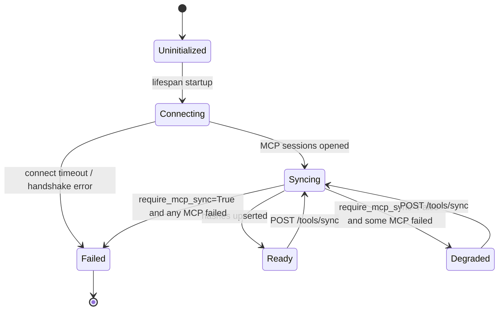

`AstraServer` keeps a `ToolDefinition` table in your storage backend that mirrors every tool reachable from a registered agent or team. The sync runs once during the FastAPI lifespan and can be retriggered manually via `POST /tools/sync`. Local Python tools are introspected directly; MCP tools are listed over an already-connected MCP session. Hashes drive change detection so only schemas that actually changed get written.

Source: [sync/tool_sync.py](https://github.com/astra-dev/astra/blob/main/astra/runtime/src/runtime/sync/tool_sync.py) and [sync/tool_cache.py](https://github.com/astra-dev/astra/blob/main/astra/runtime/src/runtime/sync/tool_cache.py).

## Local versus MCP

| | Local tools | MCP tools |
| --- | --- | --- |
| Source | `framework.tool.Tool` subclasses | `framework.tool.mcp.MCPToolkit` |
| Schema source | Class `parameters` + `output_schema` | `mcp.list_tools()` over JSON-RPC |
| Slug format | `local-<slug>` (lowercased, `_` to `-`) | `mcp:<server>-<tool>` |
| Connect step | None (pure Python introspection) | Long-lived MCP session opened during lifespan |
| Failure mode | Raises `ValueError` immediately | Recorded in `MCPSyncResult.error`, governed by `require_mcp_sync` |

## SyncReport

`AstraServer.sync_tools()` returns the `to_dict()` of a `SyncReport`:

```json
{
  "local": {"synced": 3, "unchanged": 12},
  "mcp": {
    "filesystem": {"synced": 4, "unchanged": 0, "status": "ok", "error": null},
    "github":     {"synced": 0, "unchanged": 0, "status": "failed", "error": "list_tools failed after 3 attempts: ..."}
  },
  "total_synced": 7,
  "total_unchanged": 12,
  "total_failed_mcp_servers": 1
}
```

<ResponseField name="local.synced" type="integer">New or changed local tools written this run.</ResponseField>
<ResponseField name="local.unchanged" type="integer">Local tools whose hash matched the existing DB row.</ResponseField>
<ResponseField name="mcp.<server>.synced" type="integer">Per-server count of upserts.</ResponseField>
<ResponseField name="mcp.<server>.unchanged" type="integer">Per-server count of hash matches.</ResponseField>
<ResponseField name="mcp.<server>.status" type="string">`"ok"` or `"failed"`.</ResponseField>
<ResponseField name="mcp.<server>.error" type="string | null">Error string when status is failed.</ResponseField>

`MCPSyncResult` is the in-memory per-server record before aggregation: `server`, `synced`, `unchanged`, `error`.

## State machine



When `StartupSyncConfig.require_mcp_sync=True` (the default), any MCP failure during startup aborts the lifespan. Set it to `False` to enter the `Degraded` state and keep serving with whatever subset succeeded.

## Manual re-sync

`POST /tools/sync` reruns the same logic using the current `StartupSyncConfig`. It is useful after editing a tool's schema in your codebase or after restarting an MCP server. The endpoint also invalidates the in-process tool cache (see below) so the next agent invocation reads the fresh DB rows.

```bash
curl -X POST http://localhost:8000/tools/sync \
  -H "Authorization: Bearer $TOKEN"
```

## In-process cache

`runtime.sync.tool_cache` keeps two dicts: `_agent_cache[agent_id]` and `_team_cache[team_id]`, each mapping slug to `ToolDefinition`. The cache is populated on the first invocation per agent or team (lazy load) and reused thereafter. Two helpers invalidate it:

<ResponseField name="invalidate_agent_cache(agent_id=None)">
Clear one agent's cache, or all of them when called with no argument.
</ResponseField>
<ResponseField name="invalidate_team_cache(team_id=None)">
Same for teams.
</ResponseField>

Both helpers are called automatically by `PUT /tools/{slug}`, `DELETE /tools/{slug}`, and `POST /tools/sync`.

## Hashing and versioning

`compute_tool_hash(definition)` builds a canonical JSON view of `{name, slug, source, description, input_schema, output_schema, required_fields, example}` and SHA-256s it to 32 hex characters. The hash is compared against the DB row; matches skip the write. On a mismatch the version is bumped (`bump_version`: patch increment, default `1.0.0`).

## Dedup rules during sync

`sync_tools()` rejects:

- Agents with non-string or empty `id`.
- The same `agent_id` for two different agent objects (uses `id()` for identity).
- Local tools without a valid `slug`.
- The same local tool slug pointing at two different `Tool` instances.
- MCP toolkits without a valid `slug`.
- An MCP server that returns duplicate tool names from `list_tools()`.

These checks fail fast at startup so misconfigurations cannot silently produce orphan rows.

<Warning>
MCP toolkits are only synced if their underlying session is already connected (`mcp._session is not None`). The lifespan opens these sessions before calling `sync_tools()`, so manual invocations of `sync_tools()` outside the FastAPI lifespan must take care to connect MCP toolkits first.
</Warning>

<Tip>
If you do not want any tool sync at all, pass `agents=[]` and `teams=[]` to `AstraServer`. The lifespan still runs but the report contains zeroes.
</Tip>

<CardGroup cols={2}>
  <Card title="AstraServer" icon="server" href="/runtime/astra-server">
    `StartupSyncConfig` knobs that drive this pass.
  </Card>
  <Card title="Health probes" icon="heart-pulse" href="/runtime/health-probes">
    Startup probe surfaces the sync state.
  </Card>
</CardGroup>
