# A Code-First DSL Compiler for Multi-Agent Orchestration

> [!WARNING]
> **🚧 This project is under active development and has not been released yet.** APIs, architecture, and documentation may change significantly. Contributions and feedback are welcome, but please expect breaking changes.

## Abstract

Most AI agent frameworks use a ReAct-style loop where the language model selects and executes tools one step at a time. This makes execution non-deterministic, hard to audit, and expensive in terms of token usage. We present a different approach inspired by compiler design. Instead of running the model inside the execution loop, we use it only for planning. The model generates a short program in a restricted subset of Python, which is then parsed, validated for safety, and compiled into a typed directed graph. A deterministic executor runs this graph with no model calls during execution. This keeps the number of LLM calls fixed at two or three regardless of workflow complexity. In our evaluation on a multi-agent investment research task with 17 tool calls across four agents, our approach used 3 LLM calls compared to 13 in the ReAct baseline, with lower token usage and faster execution.

## 1. Introduction

Large language models can now call external tools, search the web, write code, and coordinate with other models. This has led to a wave of agent frameworks that let developers build systems where a model reasons, picks tools, executes them, and repeats until a task is done. The most common pattern behind these frameworks is the ReAct loop (Yao et al., 2023), where the model alternates between thinking and acting in a step-by-step cycle.

Most AI agent frameworks follow this approach. When a user submits a query, the model selects a tool with input parameters, observes the output, decides the next tool to call, and repeats this process until it believes the task is complete. While this is flexible and easy to implement, it creates several practical problems that become harder to ignore as these systems move into production.

First, execution is non-deterministic. Because the model decides the next step at runtime, the same query can take different execution paths across runs. A slight change in wording or model temperature can lead to a completely different sequence of tool calls. This makes testing and debugging difficult.

Second, every tool step requires another LLM call. As workflows grow longer and involve more tools, the number of model calls increases linearly. This drives up latency, token usage, and cost. In a multi-agent setup where a coordinator delegates to several specialist agents, each of which calls its own tools, the total number of LLM calls can easily reach double digits for a single user query.

Third, there is no way to inspect or validate the full plan ahead of time. Because the model decides what to do one step at a time, the complete execution path only becomes visible after everything has already run. This makes it hard to enforce constraints, detect errors early, or explain to a user what the system is about to do.

Fourth, there is no formal boundary between what the model decides and what actually executes. The model can call the wrong tool, repeat actions, skip steps, or get stuck in repetitive cycles. In production systems, this lack of control is a real problem.

### The Key Insight

We observe that agent orchestration can be modeled as a compilation problem. In a traditional compiler, a high-level program is parsed into an abstract syntax tree, validated against a set of rules, lowered into an intermediate representation, and then executed by a runtime. The same structure applies to agent workflows:

- The LLM acts as the _frontend_, generating a plan as source code.
- A compiler _validates and lowers_ this code into a structured graph.
- A deterministic executor _runs_ the graph, step by step, outside the model loop.

This separation between planning and execution is the core idea behind our work. The model is good at reasoning about what tools to call and in what order. But it does not need to be in the loop during execution. Once the plan is generated, a machine can run it faster, cheaper, and more reliably.

### Our Approach

We present a system that implements this idea end to end. Given a user query and a set of available tools, the system works as follows:

1. A **semantic layer** is built from all registered tools, capturing their names, parameters, return types, and usage examples. This layer supports both native Python tools and remote tools exposed through the Model Context Protocol (MCP).

2. When the number of tools is large, a **planner model** reads the semantic layer and selects the relevant agents and tools for the current query. This produces a focused subset and a high-level task summary.

3. A **code generation model** converts the plan into a short Python program using a restricted subset of the language. This subset allows variable assignment, tool calls, if/else branching, and for loops, but blocks imports, file access, exec, eval, and arbitrary code execution.

4. The generated code is **parsed into an AST** and validated for safety. A plan builder then walks the AST and compiles it into a **typed directed graph** with five node types (action, transform, respond, branch, loop) connected by semantic edges.

5. The graph is **validated** for structural correctness, and then a **deterministic executor** runs it node by node. Tool calls are dispatched to their actual implementations, and results are written to a shared state. No model calls happen during this phase.

6. After execution completes, a **final model call** formats the raw tool results into a readable response for the user.

The total number of LLM calls is fixed at two or three, regardless of how many tools the workflow involves.

### Contributions

This paper makes the following contributions:

1. We frame multi-agent orchestration as a compilation problem and present an architecture that separates LLM-based planning from deterministic execution.

2. We define a restricted Python subset that is expressive enough to cover common multi-agent patterns (sequential tool calls, conditional logic, iteration) while being safe to compile and execute without sandboxing concerns.

3. We describe the full compiler pipeline from semantic layer construction through AST parsing, plan building, plan validation, and graph execution.

4. We evaluate the system on a multi-agent investment research task and compare it with ReAct-based frameworks, showing reductions in the number of LLM calls, token usage, and execution time.

### Paper Organization

The rest of this paper is organized as follows. Section 2 discusses related work on tool-augmented agents, multi-agent frameworks, and code generation for agent actions. Section 3 describes the system architecture and the compiler pipeline in detail. Section 4 presents the experimental setup and results. Section 5 discusses limitations and directions for future work. Section 6 concludes.

## 2. Related Work

Our work sits at the intersection of tool-augmented language models, multi-agent orchestration, and code generation for agent actions. We discuss the most relevant lines of work below and explain how our approach differs from each.

### 2.1 Tool-Augmented Language Models

The idea that language models can learn to call external tools was introduced by Toolformer (Schick et al., 2023), which trained a model to insert API calls into its own text in a self-supervised way. This showed that LLMs can decide when and how to use tools, but the tool calls were embedded directly in the generation stream with no separation between planning and execution.

More recent models like GPT-4, Gemini, and Claude support tool use natively through function calling APIs. The model receives a list of tool schemas, generates a structured call (usually JSON), and the framework executes it. This is a step forward from Toolformer, but the model still operates inside a loop: it generates one call at a time, observes the result, and decides the next step.

Our system uses the model for tool selection as well, but the key difference is that all tool calls are generated upfront in a single program. The model does not see intermediate results and does not make runtime decisions about what to call next.

### 2.2 ReAct and Agentic Loops

ReAct (Yao et al., 2023) introduced the pattern of interleaving reasoning traces with actions, creating a think-act-observe loop. This became the standard execution model for most agent frameworks, including LangChain, Agno, CrewAI, and others. ReAct is flexible because the model can adapt its plan based on what it observes at each step. However, as discussed in our introduction, this flexibility comes at the cost of non-determinism, linear growth in LLM calls, and limited inspectability.

We take the opposite approach. Rather than letting the model adapt at each step, we ask it to commit to a full plan before execution starts. This makes the execution path fixed and visible, at the cost of some adaptability. In practice, we find that for structured multi-agent tasks where the tool set is known in advance, full upfront planning works well and avoids the overhead of step-by-step reasoning.

### 2.3 Code as Action

Two recent papers explore using code instead of JSON or text as the action format for agents.

**CodeAct** (Wang et al., 2024) unifies the agent action space by having the model generate executable Python code at each step of the ReAct loop. Instead of outputting a JSON tool call, the model writes a code snippet that gets executed in a Python interpreter. This gives the model more expressiveness (it can use variables, conditionals, loops) and achieves up to 20% higher success rates on benchmarks. However, CodeAct still operates inside a ReAct loop. The model generates code one step at a time, observes the result, and generates the next code step. The key difference from our work is that we generate the entire program in one shot and then compile it into a graph, rather than executing code step-by-step inside a model loop.

**TaskWeaver** (Qiao et al., 2024) is a code-first agent framework from Microsoft that converts user requests into Python code through a Planner and Code Generator architecture. Like our system, it uses code as the intermediate representation and supports rich data structures. The main difference is that TaskWeaver executes the generated code directly in a stateful Python session (similar to a Jupyter notebook), while we parse the code into an AST, validate it against safety rules, and lower it into a typed graph before execution. Our approach adds a compilation step that provides safety guarantees and makes the execution plan inspectable and auditable before any code runs.

### 2.4 Multi-Agent Frameworks

Several frameworks support multi-agent collaboration, each with a different coordination model.

**AutoGen** (Wu et al., 2023) enables multi-agent applications where agents converse with each other to solve tasks. Agents can be LLM-powered, tool-calling, or human-in-the-loop. The coordination model is conversation-based: agents exchange messages until the task is done. This is flexible but hard to control. The number of messages, the order of agent participation, and the total cost are all emergent properties of the conversation rather than planned outcomes.

**MetaGPT** (Hong et al., 2023) takes a more structured approach by encoding Standardized Operating Procedures (SOPs) into agent interactions. Agents are assigned roles (product manager, engineer, etc.) and follow predefined workflows. This provides more structure than AutoGen but the workflows are defined manually rather than generated from user queries.

**LangGraph** (LangChain, 2024) represents agent workflows as state machines with nodes and edges. Developers define the graph structure manually, specifying which nodes are LLM calls, which are tool calls, and how control flows between them. LangGraph supports conditional edges and cycles, giving it more expressiveness than simple DAGs. However, the graph must be defined by the developer at implementation time. In our system, the graph is generated automatically from the user query by the LLM and compiler.

In our approach, the multi-agent coordination is expressed in the generated Python code itself. If a task needs four specialist agents, the code calls tools from all four agents in the right order, and the compiler turns this into a graph. There is no conversation between agents and no manually defined state machine. The coordination logic comes from the LLM's plan.

### 2.5 Compiled and Graph-Based Orchestration

The work most conceptually similar to ours is **LLMCompiler** (Kim et al., 2024), which also draws an analogy to classical compilers. LLMCompiler uses an LLM Planner to generate a DAG of function calls with dependency annotations, a Task Fetching Unit to dispatch ready tasks, and an Executor to run them in parallel. It achieves up to 3.7x latency speedup and 6.7x cost savings compared to ReAct by parallelizing independent function calls.

Our system shares the compiler metaphor but differs in several important ways. First, LLMCompiler generates a linearized task list with dependency markers (like `$1, $2` for argument references), while we generate actual Python code and compile it through a full AST-to-graph pipeline. Second, LLMCompiler focuses primarily on parallelizing independent function calls within a single query, while our system handles the full spectrum of multi-agent patterns including sequential dependencies, conditional branching, and iteration. Third, our compilation pipeline includes explicit safety validation (blocking imports, file access, exec/eval) that LLMCompiler does not address, since it operates at the function-call level rather than the code level.

**DSPy** (Khattab et al., 2023) takes a different approach by treating LM interactions as declarative modules that can be compiled and optimized. DSPy's "compiler" optimizes prompt templates, selects demonstrations, and fine-tunes models to maximize a metric. The compilation in DSPy is about optimizing how the model is prompted, not about compiling a runtime execution plan. Our use of the word "compiler" refers to something different: we compile generated code into an executable graph. The two approaches are complementary. DSPy could be used to optimize the prompts we give to our planner and code generation models.

### Summary of Positioning

| System      | Model in Loop?     | Action Format   | Graph Generation       | Safety Validation |
| ----------- | ------------------ | --------------- | ---------------------- | ----------------- |
| ReAct       | Yes (every step)   | JSON/text       | None                   | None              |
| CodeAct     | Yes (every step)   | Python code     | None                   | None              |
| TaskWeaver  | Yes (per subtask)  | Python code     | None                   | Sandbox           |
| AutoGen     | Yes (conversation) | Messages        | None                   | None              |
| MetaGPT     | Yes (per role)     | Messages        | Manual SOPs            | None              |
| LangGraph   | Yes (per node)     | Varies          | Manual definition      | None              |
| LLMCompiler | Plan once          | Task list       | DAG from planner       | None              |
| DSPy        | Optimized away     | Declarative     | None                   | None              |
| **Ours**    | **Plan once**      | **Python code** | **AST to typed graph** | **Compile-time**  |

## 3. System Architecture

Our system follows a compiler-style pipeline. When a user sends a query, the context builder first assembles a structured description of all available tools. An LLM then generates a short Python program that defines the tool calls and their input parameters. The compiler parses this program into an abstract syntax tree (AST), validates it against safety rules, and lowers it into a typed execution graph. Once the graph passes validation, a deterministic executor runs it node by node, invoking the underlying tools without any further LLM involvement. After execution completes, a final LLM call converts the raw tool outputs into a user-readable response. Figure 1 illustrates the full pipeline.

```mermaid
graph LR
A["Context Builder<br/>Query + Tools + MCP"]:::blue
B["Code Generation LLM<br/>Plan as Restricted Python"]:::orange
C["Compiler Pipeline<br/>AST → Validate → Graph Build"]:::green
D["Plan Freeze<br/>Validated Execution Graph"]:::lightgreen
E["Deterministic Executor<br/>No LLM Calls"]:::teal
F["Response Synthesizer LLM<br/>Format Results"]:::orange
G["Final Response"]:::blue

A --> B --> C --> D --> E --> F --> G
C -. "retry (1–2x)" .-> B

classDef blue fill:#4A90D9,stroke:#3A70B0,color:#ffffff;
classDef orange fill:#E8853D,stroke:#C06E30,color:#ffffff;
classDef green fill:#5BAE5B,stroke:#4A8E4A,color:#ffffff;
classDef lightgreen fill:#7FCA7F,stroke:#5BAE5B,color:#ffffff;
classDef teal fill:#2E8B8B,stroke:#1E6B6B,color:#ffffff;
```

_Figure 1: End-to-end pipeline. Boxes without LLM labels are fully deterministic._

The pipeline has three main stages: planning (context builder + code generation), compilation (AST parsing, validation, and graph building), and execution (deterministic runner + response synthesis). We describe each below.

### 3.1 Context Builder

The first step is building the context that the LLM will use to generate the plan. This has two parts: the semantic layer and the optional planner.

The context builder builds a semantic layer from all registered tools. For each tool, this includes the fully qualified name (e.g., `financial_analyst.get_financial_statements`), its parameters with types, the return type, a short description, and usage examples. If the team uses remote tools through the Model Context Protocol (MCP), those definitions are pulled in at startup and merged into the same format. This layer goes into the code generation prompt so the model knows what tools exist and how to call them. It also feeds into the validator later, which uses it as a whitelist to make sure the generated code only calls tools that actually exist.

If the tool set is small enough, the full semantic layer goes straight to the code generation model. But when there are more than eight tools, the pipeline first runs a planner that reads the full layer along with the user query and picks only the relevant agents and tools. The filtered set then replaces the full layer in the prompt. This keeps the prompt shorter, saves tokens, and helps the code generation model stay on track. When skipped, no extra LLM call is made.

### 3.2 Code Generation

We use code as the intermediate representation between the LLM and the executor. We picked a restricted subset of Python over JSON tool calls or natural language plans because code naturally handles control flow like branching and iteration, and it can be parsed and compiled, which is what makes the safety checks possible.

The model gets the semantic layer (or its filtered version), the user query, and a spec defining the allowed subset. It outputs a short Python program. Tool calls show up as method calls on agent objects (e.g., `analyst.get_metrics(symbol='AAPL')`), results go into variables, and the program ends with a `synthesize_response()` call that passes everything to the output stage.

The subset is deliberately limited. It allows variable assignments, single-level if/else, single-level for loops, and safe builtins like `len`, `range`, `str`, and `dict`. Everything else is blocked: imports, function and class definitions, exception handling, while loops, async code, and dangerous operations like `eval`, `exec`, file access, and subprocess calls. Because the subset is so narrow, the generated code is safe to compile without needing a sandbox.

If the code fails parsing or validation, the errors go back to the model and it tries again. This loop runs up to three times.

### 3.3 Compilation

Once we have valid Python code, the compiler turns it into an execution graph. This happens in four steps, none of which need an LLM.

**Parsing.** The raw string is parsed into a Python AST using `ast.parse()`. If the code has syntax errors, they are caught here with line and column numbers.

**AST Validation.** A validator walks the AST and checks for anything outside the allowed subset: banned constructs like imports and class definitions, dangerous function calls, nesting deeper than one level, and tool calls that are not in the whitelist. It also checks that the code ends with exactly one `synthesize_response()` call.

**Plan Building.** The validated AST is lowered into a typed directed graph we call an ExecutionPlan. Tool calls become action nodes, pure computations become transform nodes, the final output becomes a respond node, if-statements become branch nodes with conditional edges, and for-loops become loop nodes with back-edges. Each edge carries a semantic role (then-path, else-path, loop-body, loop-back) so the executor knows how to follow them. Variables from the code become shared state fields that flow through the graph.

**Plan Validation.** The assembled graph goes through structural checks. Every branch must have exactly one true-path and one false-path edge. Every loop must have a body edge and a back-edge. Terminal nodes cannot have outgoing edges. All nodes must be reachable from the entry point. No self-loops are allowed. If anything fails, the code is rejected and the retry loop kicks in.

### 3.4 Deterministic Execution

Once the graph is validated, the executor runs it without any LLM calls. It takes the ExecutionPlan, an initial state (empty at the start), and a registry that maps tool names to their actual implementations.

The executor works as a simple cursor-based loop. It picks up the current node, runs the right handler for that node type, logs the result in a journal, and moves to the next node by following the outgoing edges. Action nodes call the actual tool and write results into the shared state. Branch nodes evaluate their condition and the executor follows the matching edge. Loop nodes iterate over a collection in the state, advancing on each visit until the items run out.

Four safety limits keep things in check: a wall-clock timeout (300 seconds by default), a cap on total node visits (10,000), a per-node visit limit (5,000, to catch infinite loops), and a state size limit (50 MB). Every node execution gets recorded in the journal with inputs, outputs, duration, and errors, so there is a complete audit trail after the run.

### 3.5 Response Synthesis

After the executor finishes, the shared state holds all the raw tool outputs. These are passed to a final LLM call along with the original user query. The model takes the structured data and turns it into a readable response for the user. This is the last LLM call in the pipeline. The total across the whole run is two (code generation + synthesis) or three (if the planner ran), no matter how many tools were called during execution.

Experiments

Results & Analysis

Limitations

Future Work

Conclusion

References
