# A Code-First DSL Compiler for Multi-Agent Orchestration

**Himanshu Sharma**
`himanshu.kumarr07@gmail.com`

_May 2026_

**Code, benchmarks, and reproduction artifacts:** [https://github.com/HeeManSu/astra-agi](https://github.com/HeeManSu/astra-agi)

## Abstract

Most AI agent frameworks use a ReAct-style loop where the language model selects and executes tools one step at a time. This makes execution non-deterministic, hard to audit, and expensive in terms of token usage. We present a different approach inspired by compiler design. Instead of running the model inside the execution loop, we use it only for planning. The model generates a short program in a restricted subset of Python, which is then parsed, validated for safety, and compiled into a typed directed graph. A deterministic executor runs this graph with no model calls during execution. This keeps the number of LLM calls fixed at two or three regardless of workflow complexity. In our evaluation on a multi-agent investment research task with 17 tool calls across four agents, the compiler architecture used 3 LLM calls per query versus 16.1 for the pooled ReAct baseline (Agno + CrewAI + AutoGen, n=54), with 2.34× lower token usage and 1.93× lower median wall-clock time.

## 1. Introduction

Large language models can now call external tools, search the web, write code, and coordinate with other models. This has led to a wave of agent frameworks that let developers build systems where a model reasons, picks tools, executes them, and repeats until a task is done. The most common pattern behind these frameworks is the ReAct loop (Yao et al., 2023), where the model alternates between thinking and acting in a step-by-step cycle.

Most AI agent frameworks follow this approach. When a user submits a query, the model selects a tool with input parameters, observes the output, decides the next tool to call, and repeats this process until it believes the task is complete. While this is flexible and easy to implement, it creates several practical problems that become harder to ignore as these systems move into production.

First, execution is non-deterministic. Because the model decides the next step at runtime, the same query can take different execution paths across runs. A slight change in wording or model temperature can lead to a completely different sequence of tool calls. This makes testing and debugging difficult.

Second, every tool step requires another LLM call. As workflows grow longer and involve more tools, the number of model calls increases linearly. This drives up latency, token usage, and cost. In a multi-agent setup where a coordinator delegates to several specialist agents, each of which calls its own tools, the total number of LLM calls can easily reach double digits for a single user query.

Third, there is no way to inspect or validate the full plan ahead of time. Because the model decides what to do one step at a time, the complete execution path only becomes visible after everything has already run. This makes it hard to enforce constraints, detect errors early, or explain to a user what the system is about to do.

Fourth, there is no formal boundary between what the model decides and what actually executes. The model can call the wrong tool, repeat actions, skip steps, or get stuck in repetitive cycles. In production systems, this lack of control is a real problem.

### The Key Insight

We observe that agent orchestration can be modeled as a compilation problem. In a traditional compiler, a high-level program is parsed into an abstract syntax tree, validated against a set of rules, lowered into an intermediate representation, and then executed by a runtime. The same structure applies to agent workflows:

- The LLM acts as the _frontend_, generating a plan as source code.
- A compiler _validates and lowers_ this code into a structured graph.
- A deterministic executor _runs_ the graph, step by step, outside the model loop.

This separation between planning and execution is the core idea behind our work. The model is good at reasoning about what tools to call and in what order. But it does not need to be in the loop during execution. Once the plan is generated, a machine can run it faster, cheaper, and more reliably.

### Our Approach

We present a system that implements this idea end to end. Given a user query and a set of available tools, the system works as follows:

1. A **semantic layer** is built from all registered tools, capturing their names, parameters, return types, and usage examples. This layer supports both native Python tools and remote tools exposed through the Model Context Protocol (MCP).

2. When the number of tools is large, a **planner model** reads the semantic layer and selects the relevant agents and tools for the current query. This produces a focused subset and a high-level task summary.

3. A **code generation model** converts the plan into a short Python program using a restricted subset of the language. This subset allows variable assignment, tool calls, if/else branching, and for loops, but blocks imports, file access, exec, eval, and arbitrary code execution.

4. The generated code is **parsed into an AST** and validated for safety. A plan builder then walks the AST and compiles it into a **typed directed graph** with five node types (action, transform, respond, branch, loop) connected by semantic edges.

5. The graph is **validated** for structural correctness, and then a **deterministic executor** runs it node by node. Tool calls are dispatched to their actual implementations, and results are written to a shared state. No model calls happen during this phase.

6. After execution completes, a **final model call** formats the raw tool results into a readable response for the user.

The total number of LLM calls is fixed at two or three, regardless of how many tools the workflow involves.

### Contributions

This paper makes the following contributions:

1. We frame multi-agent orchestration as a compilation problem and present an architecture that separates LLM-based planning from deterministic execution.

2. We define a restricted Python subset that is expressive enough to cover common multi-agent patterns (sequential tool calls, conditional logic, iteration) while being safe to compile and execute without sandboxing concerns.

3. We describe the full compiler pipeline from semantic layer construction through AST parsing, plan building, plan validation, and graph execution.

4. We articulate four properties of the design (bounded LLM calls, inspectable plans, compile-time safety, and replayable execution) that together explain why the compilation framing is a useful abstraction for production agent systems.

5. We evaluate the approach on a multi-agent investment research workload as a **compiler-vs-ReAct architecture comparison**. The ReAct architecture is instantiated by three widely-used implementations (Agno, CrewAI, and AutoGen), whose results are pooled in headline summaries; per-implementation numbers are reported alongside. We report LLM calls, tokens, wall-clock time, and clean-completion rate.

### Paper Organization

The rest of this paper is organized as follows. Section 2 discusses related work on tool-augmented agents, multi-agent frameworks, and code generation for agent actions. Section 3 describes the system architecture and the compiler pipeline in detail, ending with the four design properties that follow from the architecture. Section 4 presents the experimental setup. Section 5 reports results, comparing the compiler architecture against the pooled ReAct baseline (Agno + CrewAI + AutoGen). Section 6 discusses limitations honestly. Section 7 concludes.

## 2. Related Work

Our work sits at the intersection of tool-augmented language models, multi-agent orchestration, and code generation for agent actions. We discuss the most relevant lines of work below and explain how our approach differs from each.

### 2.1 Tool-Augmented Language Models

The idea that language models can learn to call external tools was introduced by Toolformer (Schick et al., 2023), which trained a model to insert API calls into its own text in a self-supervised way. This showed that LLMs can decide when and how to use tools, but the tool calls were embedded directly in the generation stream with no separation between planning and execution.

More recent models like GPT-4, Gemini, and Claude support tool use natively through function calling APIs. The model receives a list of tool schemas, generates a structured call (usually JSON), and the framework executes it. This is a step forward from Toolformer, but the model still operates inside a loop: it generates one call at a time, observes the result, and decides the next step.

Our system uses the model for tool selection as well, but the key difference is that all tool calls are generated upfront in a single program. The model does not see intermediate results and does not make runtime decisions about what to call next.

### 2.2 ReAct and Agentic Loops

ReAct (Yao et al., 2023) introduced the pattern of interleaving reasoning traces with actions, creating a think-act-observe loop. This became the standard execution model for most agent frameworks, including LangChain, Agno, CrewAI, and others. ReAct is flexible because the model can adapt its plan based on what it observes at each step. However, as discussed in our introduction, this flexibility comes at the cost of non-determinism, linear growth in LLM calls, and limited inspectability.

We take the opposite approach. Rather than letting the model adapt at each step, we ask it to commit to a full plan before execution starts. This makes the execution path fixed and visible, at the cost of some adaptability. In practice, we find that for structured multi-agent tasks where the tool set is known in advance, full upfront planning works well and avoids the overhead of step-by-step reasoning.

### 2.3 Code as Action

Two recent papers explore using code instead of JSON or text as the action format for agents.

**CodeAct** (Wang et al., 2024) unifies the agent action space by having the model generate executable Python code at each step of the ReAct loop. Instead of outputting a JSON tool call, the model writes a code snippet that gets executed in a Python interpreter. This gives the model more expressiveness (it can use variables, conditionals, loops) and achieves up to 20% higher success rates on benchmarks. However, CodeAct still operates inside a ReAct loop. The model generates code one step at a time, observes the result, and generates the next code step. The key difference from our work is that we generate the entire program in one shot and then compile it into a graph, rather than executing code step-by-step inside a model loop.

**TaskWeaver** (Qiao et al., 2024) is a code-first agent framework from Microsoft that converts user requests into Python code through a Planner and Code Generator architecture. Like our system, it uses code as the intermediate representation and supports rich data structures. The main difference is that TaskWeaver executes the generated code directly in a stateful Python session (similar to a Jupyter notebook), while we parse the code into an AST, validate it against safety rules, and lower it into a typed graph before execution. Our approach adds a compilation step that provides safety guarantees and makes the execution plan inspectable and auditable before any code runs.

### 2.4 Multi-Agent Frameworks

Several frameworks support multi-agent collaboration, each with a different coordination model.

**AutoGen** (Wu et al., 2023) enables multi-agent applications where agents converse with each other to solve tasks. Agents can be LLM-powered, tool-calling, or human-in-the-loop. The coordination model is conversation-based: agents exchange messages until the task is done. This is flexible but hard to control. The number of messages, the order of agent participation, and the total cost are all emergent properties of the conversation rather than planned outcomes.

**MetaGPT** (Hong et al., 2023) takes a more structured approach by encoding Standardized Operating Procedures (SOPs) into agent interactions. Agents are assigned roles (product manager, engineer, etc.) and follow predefined workflows. This provides more structure than AutoGen but the workflows are defined manually rather than generated from user queries.

**LangGraph** (LangChain, 2024) represents agent workflows as state machines with nodes and edges. Developers define the graph structure manually, specifying which nodes are LLM calls, which are tool calls, and how control flows between them. LangGraph supports conditional edges and cycles, giving it more expressiveness than simple DAGs. However, the graph must be defined by the developer at implementation time. In our system, the graph is generated automatically from the user query by the LLM and compiler.

In our approach, the multi-agent coordination is expressed in the generated Python code itself. If a task needs four specialist agents, the code calls tools from all four agents in the right order, and the compiler turns this into a graph. There is no conversation between agents and no manually defined state machine. The coordination logic comes from the LLM's plan.

### 2.5 Compiled and Graph-Based Orchestration

The work most conceptually similar to ours is **LLMCompiler** (Kim et al., 2024), which also draws an analogy to classical compilers. LLMCompiler uses an LLM Planner to generate a DAG of function calls with dependency annotations, a Task Fetching Unit to dispatch ready tasks, and an Executor to run them in parallel. It achieves up to 3.7x latency speedup and 6.7x cost savings compared to ReAct by parallelizing independent function calls.

Our system shares the compiler metaphor but differs in several important ways. First, LLMCompiler generates a linearized task list with dependency markers (like `$1, $2` for argument references), while we generate actual Python code and compile it through a full AST-to-graph pipeline. Second, LLMCompiler focuses primarily on parallelizing independent function calls within a single query, while our system handles the full spectrum of multi-agent patterns including sequential dependencies, conditional branching, and iteration. Third, our compilation pipeline includes explicit safety validation (blocking imports, file access, exec/eval) that LLMCompiler does not address, since it operates at the function-call level rather than the code level.

**DSPy** (Khattab et al., 2023) takes a different approach by treating LM interactions as declarative modules that can be compiled and optimized. DSPy's "compiler" optimizes prompt templates, selects demonstrations, and fine-tunes models to maximize a metric. The compilation in DSPy is about optimizing how the model is prompted, not about compiling a runtime execution plan. Our use of the word "compiler" refers to something different: we compile generated code into an executable graph. The two approaches are complementary. DSPy could be used to optimize the prompts we give to our planner and code generation models.

### Summary of Positioning

| System      |     Model in Loop? |   Action Format |       Graph Generation | Safety Validation |
| ----------- | -----------------: | --------------: | ---------------------: | ----------------: |
| ReAct       |   Yes (every step) |       JSON/text |                   None |              None |
| CodeAct     |   Yes (every step) |     Python code |                   None |              None |
| TaskWeaver  |  Yes (per subtask) |     Python code |                   None |           Sandbox |
| AutoGen     | Yes (conversation) |        Messages |                   None |              None |
| MetaGPT     |     Yes (per role) |        Messages |            Manual SOPs |              None |
| LangGraph   |     Yes (per node) |          Varies |      Manual definition |              None |
| LLMCompiler |          Plan once |       Task list |       DAG from planner |              None |
| DSPy        |     Optimized away |     Declarative |                   None |              None |
| **Ours**    |      **Plan once** | **Python code** | **AST to typed graph** |  **Compile-time** |

## 3. System Architecture

Our system follows a compiler-style pipeline. When a user sends a query, the context builder first assembles a structured description of all available tools. An LLM then generates a short Python program that defines the tool calls and their input parameters. The compiler parses this program into an abstract syntax tree (AST), validates it against safety rules, and lowers it into a typed execution graph. Once the graph passes validation, a deterministic executor runs it node by node, invoking the underlying tools without any further LLM involvement. After execution completes, a final LLM call converts the raw tool outputs into a user-readable response. Figure 1 illustrates the full pipeline.

```mermaid
graph LR
A["Context Builder<br/>Query + Tools + MCP"]:::blue
B["Code Generation LLM<br/>Plan as Restricted Python"]:::orange
C["Compiler Pipeline<br/>AST → Validate → Graph Build"]:::green
D["Plan Freeze<br/>Validated Execution Graph"]:::lightgreen
E["Deterministic Executor<br/>No LLM Calls"]:::teal
F["Response Synthesizer LLM<br/>Format Results"]:::orange
G["Final Response"]:::blue

A --> B --> C --> D --> E --> F --> G
C -. "retry (1–2x)" .-> B

classDef blue fill:#4A90D9,stroke:#3A70B0,color:#ffffff;
classDef orange fill:#E8853D,stroke:#C06E30,color:#ffffff;
classDef green fill:#5BAE5B,stroke:#4A8E4A,color:#ffffff;
classDef lightgreen fill:#7FCA7F,stroke:#5BAE5B,color:#ffffff;
classDef teal fill:#2E8B8B,stroke:#1E6B6B,color:#ffffff;
```

_Figure 1: End-to-end pipeline. Boxes without LLM labels are fully deterministic._

The pipeline has three main stages: planning (context builder + code generation), compilation (AST parsing, validation, and graph building), and execution (deterministic runner + response synthesis). We describe each below.

### 3.1 Context Builder

The first step is building the context that the LLM will use to generate the plan. This has two parts: the semantic layer and the optional planner.

The context builder builds a semantic layer from all registered tools. For each tool, this includes the fully qualified name (e.g., `financial_analyst.get_financial_statements`), its parameters with types, the return type, a short description, and usage examples. If the team uses remote tools through the Model Context Protocol (MCP), those definitions are pulled in at startup and merged into the same format. This layer goes into the code generation prompt so the model knows what tools exist and how to call them. It also feeds into the validator later, which uses it as a whitelist to make sure the generated code only calls tools that actually exist.

If the tool set is small enough, the full semantic layer goes straight to the code generation model. But when there are more than eight tools, the pipeline first runs a planner that reads the full layer along with the user query and picks only the relevant agents and tools. The filtered set then replaces the full layer in the prompt. This keeps the prompt shorter, saves tokens, and helps the code generation model stay on track. When skipped, no extra LLM call is made.

### 3.2 Code Generation

We use code as the intermediate representation between the LLM and the executor. We picked a restricted subset of Python over JSON tool calls or natural language plans because code naturally handles control flow like branching and iteration, and it can be parsed and compiled, which is what makes the safety checks possible.

The model gets the semantic layer (or its filtered version), the user query, and a spec defining the allowed subset. It outputs a short Python program. Tool calls show up as method calls on agent objects (e.g., `analyst.get_metrics(symbol='AAPL')`), results go into variables, and the program ends with a `synthesize_response()` call that passes everything to the output stage.

The subset is deliberately limited. It allows variable assignments, single-level if/else, single-level for loops, and safe builtins like `len`, `range`, `str`, and `dict`. Everything else is blocked: imports, function and class definitions, exception handling, while loops, async code, and dangerous operations like `eval`, `exec`, file access, and subprocess calls. Because the subset is so narrow, the generated code is safe to compile without needing a sandbox.

If the code fails parsing or validation, the errors go back to the model and it tries again. This loop runs up to three times.

### 3.3 Compilation

Once we have valid Python code, the compiler turns it into an execution graph. This happens in four steps, none of which need an LLM.

**Parsing.** The raw string is parsed into a Python AST using `ast.parse()`. If the code has syntax errors, they are caught here with line and column numbers.

**AST Validation.** A validator walks the AST and checks for anything outside the allowed subset: banned constructs like imports and class definitions, dangerous function calls, nesting deeper than one level, and tool calls that are not in the whitelist. It also checks that the code ends with exactly one `synthesize_response()` call.

**Plan Building.** The validated AST is lowered into a typed directed graph we call an ExecutionPlan. Tool calls become action nodes, pure computations become transform nodes, the final output becomes a respond node, if-statements become branch nodes with conditional edges, and for-loops become loop nodes with back-edges. Each edge carries a semantic role (then-path, else-path, loop-body, loop-back) so the executor knows how to follow them. Variables from the code become shared state fields that flow through the graph.

**Plan Validation.** The assembled graph goes through structural checks. Every branch must have exactly one true-path and one false-path edge. Every loop must have a body edge and a back-edge. Terminal nodes cannot have outgoing edges. All nodes must be reachable from the entry point. No self-loops are allowed. If anything fails, the code is rejected and the retry loop kicks in.

### 3.4 Deterministic Execution

Once the graph is validated, the executor runs it without any LLM calls. It takes the ExecutionPlan, an initial state (empty at the start), and a registry that maps tool names to their actual implementations.

The executor works as a simple cursor-based loop. It picks up the current node, runs the right handler for that node type, logs the result in a journal, and moves to the next node by following the outgoing edges. Action nodes call the actual tool and write results into the shared state. Branch nodes evaluate their condition and the executor follows the matching edge. Loop nodes iterate over a collection in the state, advancing on each visit until the items run out.

Four safety limits keep things in check: a wall-clock timeout (300 seconds by default), a cap on total node visits (10,000), a per-node visit limit (5,000, to catch infinite loops), and a state size limit (50 MB). Every node execution gets recorded in the journal with inputs, outputs, duration, and errors, so there is a complete audit trail after the run.

### 3.5 Response Synthesis

After the executor finishes, the shared state holds all the raw tool outputs. These are passed to a final LLM call along with the original user query. The model takes the structured data and turns it into a readable response for the user. This is the last LLM call in the pipeline. The total across the whole run is two (code generation + synthesis) or three (if the planner ran), no matter how many tools were called during execution.

### 3.6 Properties of the Design

Splitting planning from execution gives the system four properties that we believe matter for production use. None of them are emergent behaviors. They follow directly from the pipeline structure.

**Bounded LLM calls.** The number of model calls per query is fixed at two (code generation and response synthesis) or three (if the planner runs first). It does not grow with the number of tools, the depth of the workflow, the number of branches, or the number of loop iterations. This is because the model is only invoked at the boundaries of execution, never inside it. In a ReAct loop, every tool call is preceded by a model decision. In our system, the model decides everything once and then steps out of the way. The cost of running a workflow becomes a property of the plan, not a property of how many tools it touches.

**Inspectable plans.** The execution graph exists as a concrete object before any tool runs. It can be serialized to JSON, rendered as a diagram, shown to the user for confirmation, or rejected by a policy layer. A ReAct system cannot expose its plan up front because the plan is generated one step at a time and is only fully visible after execution. Pre-execution inspectability matters in regulated domains (finance, healthcare, legal) where a system's intended actions need to be reviewable before they happen.

**Compile-time safety.** The validator checks that the generated program does not import modules, define functions or classes, call `eval` or `exec`, perform file I/O, or invoke any tool that is not in the registered whitelist. These checks happen on the AST before the program is converted into a graph and before any tool is dispatched. The safety guarantee is structural, it follows from the validator rejecting any AST node that is not in the allowed set. Sandboxing the runtime would catch the same things, but at higher cost and after the program has already started.

**Replayable execution.** Every node visit during execution writes an entry to a journal containing the node ID, the inputs read from shared state, the outputs written, the wall-clock duration, and any errors. Because the executor is deterministic and the graph is fixed, replaying a run with the same inputs produces the same execution path. This makes debugging, observability, and post-incident analysis straightforward, there is no hidden state inside a model loop to reconstruct.

These properties are what we mean by "compilation as orchestration." They are familiar from the world of programming-language compilers (you can inspect IR, the type checker rejects unsafe programs, optimizations are verifiable) and we argue they transfer cleanly to the agent setting once the LLM is moved out of the execution loop.

## 4. Experiments

To check whether the design behaves the way we expect, we ran a controlled benchmark on a multi-agent investment research workload. The same model, same tools, same agent prompts, and same queries are used on every system. Only the orchestration framework changes.

### 4.1 Research Questions

The experiments are organized around three questions:

- **Q1 (cost).** Does compile-then-execute reduce the number of LLM calls and total tokens compared to a ReAct loop on the same workload?
- **Q2 (latency).** Does the same architecture reduce wall-clock time per query, given that fewer LLM calls means fewer round-trips to the model API?
- **Q3 (gap to a hand-written graph).** When a developer writes the agent graph by hand, they bypass the ReAct loop. How does an automatically compiled graph compare to that hand-written reference point?

This is primarily a **compiler-based vs ReAct-based architecture comparison, not a head-to-head between specific frameworks**. The ReAct architecture is represented by Agno, CrewAI, and AutoGen. LangGraph is included as an additional reference point in the benchmark. It does not follow a full ReAct loop; it is a hand-authored graph where the developer manually wires the orchestration. Each framework has distinct goals and design choices, and we make no claim about which is the better product overall.

### 4.2 Workload

We use a multi-agent investment research task built around four specialist agents that collaborate to produce a report on a public company:

- **Macro Strategist**, analyzes the broader macroeconomic regime (rates, growth, inflation).
- **Financial Analyst**, pulls and interprets the company's financial statements.
- **Valuation Analyst**, runs comparable-company and ratio-based valuation.
- **Technical Analyst**, looks at price action, moving averages, and momentum.

A team coordinator routes the user query to these agents and produces a final synthesized report. Each agent has its own set of tools, primarily `yfinance` and FRED API calls for market and macro data. The total tool surface across all four agents is 17 tools.

The benchmark uses six fixed queries, chosen to cover different shapes of work:

- **Q1, Q2, Q3**, single-symbol research reports (AAPL, MSFT, NVDA). The simplest case: every agent runs once.
- **Q6**, head-to-head comparison of two symbols (AAPL vs MSFT). Every tool fires twice. Stresses fan-out.
- **Q7**, three-way comparison (AAPL, MSFT, GOOGL). Fan-out stress test. Every tool fires three times. This is where bounded LLM calls matter most: a ReAct loop scales linearly with the number of symbols, while a compiled graph stays at a fixed planning cost.
- **Q9**, conditional query: "if the macro regime is risk-off, focus the verdict on downside scenarios; if risk-on, emphasize upside." Tests how each system handles control flow.

Each query is run 3 times per framework, giving 18 trials per framework on the research workload. With five frameworks, that is 90 trials total.

### 4.3 Architectures Compared

The comparison is organized around three orchestration architectures, not around individual frameworks. The architectures are:

- **Compiler**, the system described in §3. The LLM produces a plan as a short Python program at the start of the run; a deterministic executor then runs the graph outside the model loop, invoking tools directly without any further LLM involvement. A final LLM call formats the collected output into a user-facing response.
- **ReAct loop**, the model alternates between thinking and acting at each step, deciding the next tool call based on the prior tool's output. This is the dominant pattern in current production agent systems.
- **Hand-authored graph**, a developer writes the orchestration graph directly. No ReAct loop, but no automatic graph generation either; one graph per workflow, paid for in developer time.

For each architecture we use one or more concrete framework implementations:

| Architecture        |                   Implementation(s) |                                                                                                                                                                                                                                                                                                                                                 Notes |
| ------------------- | ----------------------------------: | ----------------------------------------------------------------------------------------------------------------------------------------------------------------------------------------------------------------------------------------------------------------------------------------------------------------------------------------------------: |
| Compiler            |                    **Astra** (ours) |                                                                                                                                                                                                                                                                                                               Single instance, the system under test. |
| ReAct loop          | **Agno** + **CrewAI** + **AutoGen** | Three widely-used implementations, all run as leader-driven ReAct loops (a manager LLM picks the next agent, each agent runs its own ReAct loop). We pool their results in headline tables and report per-framework breakdowns in a supplementary section so the headline reflects ReAct as an architecture, not any one framework's specific design. |
| Hand-authored graph |                       **LangGraph** |                                                                                                                                                                                                                                                            Single mainstream implementation. Shows the cost of manually authored graph orchestration. |

The ReAct family is represented by three implementations rather than one because individual frameworks differ in coordinator design and in failure modes; pooling all three yields a more representative ReAct-family number than any single one alone. All three are run with the model in the orchestration loop, so the comparison is apples-to-apples; we deliberately exclude developer-orchestrated variants (where the human hard-codes the task order) because those are not model-in-the-loop at the team level and would not be a fair ReAct comparison.

Astra and LangGraph both bypass the per-step ReAct loop at the orchestration level. Neither has a model-in-the-loop coordinator picking the next step. They differ in two ways: **who writes the graph** (LangGraph: the developer; Astra: the LLM, from the user query) and **what the graph contains** (LangGraph's nodes still call the LLM for each agent's reasoning; Astra's graph runs deterministically with no LLM calls during execution). The second difference is why Astra averages 3 LLM calls per query while LangGraph averages 9.8.

### 4.4 Model and Configuration

All five systems use the same model (Google's `gemini-2.5-flash`, `temperature=0.0`, thinking tokens disabled), the same underlying tools (yfinance + FRED Python implementations), and byte-identical agent prompts verified via string-hash diff. Memory and cross-call state are disabled on every framework, and we verified that no thinking tokens were generated on any successful trial.

Two small additions to the user-side wrappers are needed to restore parity, and are disclosed here:

- **AutoGen's analyst prompts** include a 5-line footer telling each specialist to produce its section even on compound queries. This is needed because the other frameworks' managers automatically reframe compound queries into per-analyst sub-tasks before delegating, whereas AutoGen's `SelectorGroupChat` passes the raw query through; the footer restores parity.
- **LangGraph's per-node `user_prompt` wrappers** include the same kind of scoping clause: _"Produce your section even if the query asks for a ranking or comparison; those higher-level decisions are made downstream."_ This is needed because LangGraph is hand-graph; without a manager to reframe, each analyst node sees the raw query and its system prompt's "do not make portfolio allocation decisions" rule would otherwise refuse comparative-ranking queries.

In both cases the addition lives in the user-side wrapper, not in the analyst system prompt, and does not change the model, tools, or system instructions across frameworks.

### 4.5 Metrics

For each trial we record:

- **LLM calls**, number of distinct calls to the model API during a single query.
- **Prompt tokens, completion tokens, total tokens**, read directly from the SDK's `usage_metadata` on every call.
- **Wall-clock time**, total time from query submission to final response, measured at the harness boundary.
- **Response length (chars)**, length of the final user-facing response. Reported as a shape proxy, not a quality measure.

Token counts on every framework are captured at the same `google.genai` SDK boundary, so the per-framework numbers are directly comparable with no proxy or estimation.

### 4.6 Reproduction

The benchmark driver is a single Python script (`benchmarking/run.py`) that runs each (framework, query, trial) combination in its own subprocess, so the five frameworks' top-level module names cannot interfere. A 2-second sleep between trials reduces Gemini rate-limit collisions, and re-running is idempotent: trials with an existing result are skipped unless `--force` is passed.

Token counts come from the same patch point on every framework. Before each trial, a class-level monkey-patch wraps the `google.genai` SDK's content-generation entry points; every call's full request, full response, and `usage_metadata` are written to disk. Per-trial totals are summed directly from `usage_metadata` (the same field Google uses for billing) and can be independently re-verified by re-tokenizing the captured request payloads with `google.genai`'s `count_tokens()`. Every trial leaves a self-contained folder under `benchmarking/runs/<framework>/<query>_trial<N>/` with the per-call dumps and a one-line trial summary.

The dataset reported in §5 is the full 5 × 6 × 3 matrix (5 frameworks × 6 queries × 3 trials = 90 trials). All code and per-trial outputs are at the repository linked above.

## 5. Results and Analysis

### 5.1 Headline Numbers

We report results in two layers: an **architectural** view in Table 1 (the comparison the paper's claims rest on), and a **per-framework** view in Table 2 (so any single vendor's behavior is auditable without dominating the headline). The dataset is the full 5 × 6 × 3 matrix: 5 frameworks × 6 queries × 3 trials = 90 trials, all of which returned a non-error response.

**Table 1.** Architectural-family results on the multi-agent research workload. Astra and LangGraph rows are n=18; ReAct pool is n=54 (Agno + CrewAI + AutoGen, 18 trials each). All 90 trials returned the four-section research packet. Wall-clock is reported at p50 because tail latency is dominated by API jitter at this scale.

| Architecture                         |   calls | tokens (mean / p95) | wall p50 (s) |
| ------------------------------------ | ------: | ------------------: | -----------: |
| **Compiler (Astra)**                 | **3.0** | **21,013 / 28,804** |     **26.1** |
| ReAct pool (Agno + CrewAI + AutoGen) |    16.1 |     49,219 / 85,452 |         50.3 |
| Hand-graph (LangGraph)               |    10.4 |     29,645 / 55,086 |         32.4 |

Two observations stand out beyond the means. First, **the compiler's call count is exactly 3.0 with zero variance** across all 18 trials, a direct consequence of the bounded-calls property from §3.6. The number is fixed by construction (planner + code generation + response synthesis), not by what the workload happens to look like. Second, the compiler's tail is essentially flat: p50 = p95 = 3.0 calls and the token p95 sits at 28,804 against the ReAct family's 85,452, a 2.97× tail gap, larger than the gap at the mean. The compiler architecture's worst trial is structurally the same as its best, because no model call is in the execution loop to add extra work on heavy queries.

**Table 2.** Per-implementation breakdown of the same trials.

| Framework |     Family |   calls |     tokens | wall p50 (s) |
| --------- | ---------: | ------: | ---------: | -----------: |
| **Astra** |   compiler | **3.0** | **21,013** |     **26.1** |
| Agno      |      ReAct |    15.4 |     51,119 |         68.0 |
| CrewAI    |      ReAct |    16.7 |     57,995 |         47.4 |
| AutoGen   |      ReAct |    16.3 |     38,544 |         40.8 |
| LangGraph | hand-graph |    10.4 |     29,645 |         32.4 |

All three ReAct implementations land in the 14–17 calls / 35K–58K tokens band. The spread within the family is roughly 1.7× on calls and 1.7× on tokens, which is wider than we'd expect from a single architectural prescription. The family is sensitive to coordinator design (Agno's leader-coordinated team, CrewAI's `manager_llm` delegation, AutoGen's selector). Pooling all three in Table 1 prevents any one implementation from dominating the architectural comparison.

### 5.2 Compiler vs ReAct (Q1, Q2)

The first two research questions concern cost and latency relative to ReAct loops. Table 3 shows the ratios against the pooled ReAct family.

**Table 3.** Compiler architecture relative to the ReAct baseline (n=54; Agno + CrewAI + AutoGen).

| Metric              | Compiler (Astra) | ReAct (pooled) | ReAct/Astra |
| ------------------- | ---------------: | -------------: | ----------: |
| LLM calls (mean)    |              3.0 |           16.1 |   **5.37×** |
| Total tokens (mean) |           21,013 |         49,219 |   **2.34×** |
| Wall p50 (s)        |             26.1 |           50.3 |   **1.93×** |

The compiler architecture uses 5.37× fewer LLM calls, 2.34× fewer total tokens, and 1.93× lower median wall-clock time than the pooled ReAct baseline on this workload. The direction is consistent across every metric we measure: removing the model from the execution loop cuts the per-query cost on calls, tokens, and latency simultaneously, because each axis is downstream of the same structural change.

The relationship between calls saved and tokens saved is not 1-to-1. A model call inside a ReAct loop carries the conversation-so-far in its prompt, so each additional call drives prompt-token growth more than completion-token growth. With ~5× fewer calls, the compiler avoids replaying the conversation history into each subsequent prompt, which is where most of the ReAct family's token cost comes from.

Beyond the means, the architectural gap is even larger at the tail: the compiler's p95 token count is 28,804 while the ReAct family's p95 is 85,452, a **2.97× gap at the worst case**. The compiler's worst trial uses the same 3 calls as its best because the execution path is fixed at compile time; the ReAct baseline's worst trial absorbs the extra round-trips the model decides to make on harder queries. We report ratios to one decimal place because per-trial Gemini variance at temperature=0 is non-zero (different tiebreakers across tied-probability token positions); single-percent-precision claims would be over-fitting to that noise.

### 5.3 Compiler vs Hand-Authored Graph

The hand-authored graph architecture is the most informative comparison because it also bypasses the per-step ReAct loop. Both architectures produce a graph that runs deterministically. The difference is who writes it. Table 4 shows the gap.

**Table 4.** Compiler architecture relative to the hand-authored graph (LangGraph).

| Metric              | Compiler (Astra) | Hand-graph (LangGraph) | Hand-graph/Compiler |
| ------------------- | ---------------: | ---------------------: | ------------------: |
| LLM calls (mean)    |              3.0 |                   10.4 |           **3.47×** |
| Total tokens (mean) |           21,013 |                 29,645 |           **1.41×** |
| Wall p50 (s)        |             26.1 |                   32.4 |           **1.24×** |

The compiler architecture uses 3.5× fewer LLM calls (3.0 vs. 10.4), 1.41× fewer tokens, and 1.24× lower wall p50. The reason: LangGraph nodes still call the model at each step. The developer wrote the graph topology, but each node is itself an LLM call. The compiler's graph has no LLM nodes during execution. The model is only consulted at compile time and at final synthesis.

The call gap (3.5×) is much larger than the token gap (1.41×). This is because LangGraph already avoids the conversation-history replay that bloats ReAct: each node has only the prior section's output in its prompt, not the full multi-turn transcript. So its per-call prompts are small. The hand-graph is on the same Pareto axis as the compiler. It just sits at a worse point on that axis.

The other half of the comparison is qualitative. The hand-authored graph requires a developer to hand-wire each node and edge per workflow. The compiler architecture generates the graph from the user query. The hand-graph numbers therefore show what is achievable when a developer pays that authoring cost; the compiler matches them (and on these queries beats them) without the manual wiring.

### 5.4 Per-Query Detail

Table 5 gives the per-query breakdown. The standout row is Q7, the three-way comparison, where AutoGen reaches 21.3 calls and Agno 20.3 while the compiler stays flat at 3.0. This is the bounded-calls property in action: the workload's logical complexity grows with the number of symbols compared, but the compiler's plan structure absorbs the fan-out without adding model calls.

**Table 5.** Per-query mean cost (3 trials per cell).

| Query                   | Framework |   Calls |     Tokens | Wall (s) | Resp chars |
| ----------------------- | --------: | ------: | ---------: | -------: | ---------: |
| Q1 (single-symbol AAPL) |     Astra |     3.0 |     18,335 |     25.6 |      4,073 |
|                         |      Agno |    14.7 |     41,402 |     64.4 |      4,946 |
|                         |    CrewAI |    16.0 |     46,648 |     51.7 |      6,501 |
|                         |   AutoGen |    13.7 |     25,248 |     31.1 |      7,198 |
|                         | LangGraph |     9.7 |     22,449 |     32.2 |      8,400 |
| Q2 (single-symbol MSFT) |     Astra |     3.0 |     18,065 |     25.5 |      4,249 |
|                         |      Agno |    14.3 |     47,172 |     64.0 |      8,837 |
|                         |    CrewAI |    16.0 |     46,332 |     44.7 |      6,786 |
|                         |   AutoGen |    15.3 |     30,598 |     51.1 |      7,954 |
|                         | LangGraph |     9.0 |     21,084 |     30.5 |      8,323 |
| Q3 (single-symbol NVDA) |     Astra |     3.0 |     18,352 |     25.3 |      4,436 |
|                         |      Agno |    14.0 |     41,627 |     60.9 |      5,978 |
|                         |    CrewAI |    16.3 |     50,239 |     48.8 |      6,687 |
|                         |   AutoGen |    15.3 |     29,233 |     36.2 |      7,841 |
|                         | LangGraph |    10.0 |     24,269 |     31.4 |      9,178 |
| Q6 (2-way compare)      |     Astra |     3.0 |     23,302 |     33.6 |      6,470 |
|                         |      Agno |    16.0 |     63,555 |    105.8 |      6,474 |
|                         |    CrewAI |    18.0 |     68,648 |     56.2 |     10,195 |
|                         |   AutoGen |    17.3 |     43,825 |     47.7 |     10,688 |
|                         | LangGraph |    10.3 |     36,429 |     40.4 |     13,420 |
| **Q7 (3-way compare)**  | **Astra** | **3.0** | **28,850** | **44.7** | **10,207** |
|                         |      Agno |    20.3 |     79,299 |     88.3 |     12,095 |
|                         |    CrewAI |    17.7 |     86,329 |     69.3 |     14,111 |
|                         |   AutoGen |    21.3 |     76,545 |     68.2 |     13,807 |
|                         | LangGraph |    13.7 |     51,476 |     45.5 |     13,483 |
| Q9 (conditional)        |     Astra |     3.0 |     19,176 |     25.0 |      4,129 |
|                         |      Agno |    13.0 |     33,658 |     59.0 |      6,103 |
|                         |    CrewAI |    16.0 |     49,775 |     46.5 |      7,195 |
|                         |   AutoGen |    14.7 |     25,814 |     41.8 |      6,230 |
|                         | LangGraph |     9.7 |     22,164 |     30.8 |      8,461 |

A few things stand out beyond Q7. The compiler's tokens grow modestly with workload size (~18K on Q1–Q3, 23K on Q6, 29K on Q7). The planner sees more agents and tools to consider, and the synthesized output is longer. The ReAct family's tokens grow much faster: Agno climbs from ~43K on single-symbol queries to 79K on Q7, and CrewAI climbs from ~48K to 86K, because every additional symbol means more tool calls and more conversation history replayed back into each subsequent prompt. AutoGen grows from ~28K to 77K because its `SelectorGroupChat` does not feed full prior-speaker transcripts into each subsequent agent's prompt the way a tightly-coordinated team does. The three ReAct implementations' divergent growth curves are themselves evidence that "ReAct token cost" is highly sensitive to coordinator design; pooling them gives a more representative family-level number than any single curve.

### 5.5 What These Numbers Say (and Don't Say)

The numbers support the cost and latency claims of §3.6: bounded LLM calls, lower token usage, and lower wall-clock time on this workload. They do **not** by themselves establish that the compilation approach is generally superior. Four caveats matter:

- **One workload.** All numbers come from a single multi-agent investment research task. Generalization to other workloads is a future-work item, not a claim made here.
- **No human evaluation of response quality.** We measure cost, not quality. Response character counts are reported for shape, not as a quality proxy. A faster-but-thinner response would look better on every metric we measure, which is obviously not the right ranking.
- **Tools and prompts are fixed.** Token counts depend on the underlying prompts. Different prompts would shift the absolute numbers, though we expect the _ratios_ between architectures to be relatively stable, because the structural difference (model-in-loop vs. model-out-of-loop) is the dominant factor.
- **Three ReAct implementations, not all of them.** The pooled ReAct row averages three widely-used frameworks (Agno + CrewAI + AutoGen) spanning coordinator-based, manager-delegation, and selector-based orchestration shapes. Other ReAct frameworks exist (LangChain classic, AG2, Swarm, MetaGPT, others) and may land at different points within the family. We treat these three as samples drawn from the family; the pooled mean is more representative than any one alone, but the family is wider than three implementations.

Within those caveats, the numbers behave as the design predicts. That is what the benchmark is meant to show.

## 6. Limitations

We list the most important limitations of the current system honestly, so readers can decide whether the approach fits their use case.

- **No replanning.** Once a graph is compiled, surprises in tool output cannot change the path. A ReAct loop can adapt step-by-step; we cannot, at least not yet. For workflows where the right next step depends on what an earlier tool returned, this is a real cost.

- **Restricted subset.** The Python subset we accept does not include `while` loops, recursion, function definitions, exception handling, or async fan-out. Some workflows simply cannot be expressed in our IR. The subset is large enough to cover what we have seen on multi-agent research tasks, but we have not measured coverage on a broader workload distribution.

- **Model dependence.** The quality of the generated plan depends on the code-generation model's grasp of the tool schemas. With a weaker model, the parse-and-validate retry loop fires more often, eating into the cost gains. The benchmark uses a single model (Gemini 2.5-flash); cross-model evaluation is a known gap.

## 7. Conclusion

We presented a system that treats agent orchestration as a compilation problem. Instead of running an LLM inside the execution loop, we use it to plan, generate a short program in a restricted Python subset, and synthesize the final response from the executed graph's outputs. The generated program is parsed and validated against compile-time safety rules, lowered into a typed graph, and executed deterministically with no further model calls during execution.

This separation gives the system four properties that follow from its structure rather than from tuning: a fixed bound on LLM calls per query, plans that are inspectable before any tool runs, compile-time safety guarantees that come from rejecting unsafe AST nodes, and replayable execution traces. On a multi-agent investment research workload covering single-symbol, comparative, and conditional queries, these properties produce measurable gains against the pooled ReAct baseline (Agno + CrewAI + AutoGen, n=54): 5.37× fewer LLM calls (3.0 vs. 16.1), 2.34× fewer total tokens (21,013 vs. 49,219), and 1.93× lower median wall-clock time (26.1s vs. 50.3s). The gap widens at the tail (compiler p95 = 28,804 tokens vs. ReAct p95 = 85,452, a 2.97× gap) because the compiler's worst trial uses the same 3 calls as its best, while the ReAct baseline's worst trial absorbs the extra round-trips the model decides to make on harder queries.

The practical implication is that the cost of running a multi-agent system can be moved from a per-step bill (proportional to workflow complexity) to a per-query bill (proportional to the planning step alone). For workflows where the structure is predictable and inspectability matters, this is a useful trade.

The full system, the benchmark harness, the five-framework comparison, and the raw per-trial data are open source at [https://github.com/HeeManSu/astra-agi](https://github.com/HeeManSu/astra-agi).

## References

[1] Yao, S., Zhao, J., Yu, D., Du, N., Shafran, I., Narasimhan, K., & Cao, Y. (2023). _ReAct: Synergizing Reasoning and Acting in Language Models_. International Conference on Learning Representations (ICLR). arXiv:2210.03629.

[2] Schick, T., Dwivedi-Yu, J., Dessì, R., Raileanu, R., Lomeli, M., Zettlemoyer, L., Cancedda, N., & Scialom, T. (2023). _Toolformer: Language Models Can Teach Themselves to Use Tools_. NeurIPS 2023. arXiv:2302.04761.

[3] Wang, X., Chen, Y., Yuan, L., Zhang, Y., Li, Y., Peng, H., & Ji, H. (2024). _Executable Code Actions Elicit Better LLM Agents_. International Conference on Machine Learning (ICML). arXiv:2402.01030.

[4] Qiao, B., Li, L., Zhang, X., He, S., Kang, Y., Zhang, C., et al. (2024). _TaskWeaver: A Code-First Agent Framework_. arXiv:2311.17541.

[5] Wu, Q., Bansal, G., Zhang, J., Wu, Y., Zhang, S., Zhu, E., Li, B., Jiang, L., Zhang, X., & Wang, C. (2023). _AutoGen: Enabling Next-Gen LLM Applications via Multi-Agent Conversation_. arXiv:2308.08155.

[6] Hong, S., Zheng, X., Chen, J., Cheng, Y., Wang, J., Zhang, C., et al. (2023). _MetaGPT: Meta Programming for a Multi-Agent Collaborative Framework_. arXiv:2308.00352.

[7] Kim, S., Moon, S., Tabrizi, R., Lee, N., Mahoney, M. W., Keutzer, K., & Gholami, A. (2024). _An LLM Compiler for Parallel Function Calling_. International Conference on Machine Learning (ICML). arXiv:2312.04511.

[8] Khattab, O., Singhvi, A., Maheshwari, P., Zhang, Z., Santhanam, K., Vardhamanan, S., Haq, S., Sharma, A., Joshi, T. T., Moazam, H., Miller, H., Zaharia, M., & Potts, C. (2023). _DSPy: Compiling Declarative Language Model Calls into Self-Improving Pipelines_. arXiv:2310.03714.

[9] LangChain (2024). _LangGraph: Building Stateful, Multi-Actor Applications with LLMs_. Documentation. https://langchain-ai.github.io/langgraph/.

[10] Anthropic (2024). _Model Context Protocol Specification_. https://modelcontextprotocol.io/.

[11] Phidata, Inc. (2024). _Agno: Multi-Agent Framework Documentation_. https://docs.agno.com/.

[12] crewAI Inc. (2024). _CrewAI: Framework for Orchestrating Role-Playing, Autonomous AI Agents_. https://github.com/crewAIInc/crewAI.

[13] Mialon, G., Fourrier, C., Swift, C., Wolf, T., LeCun, Y., & Scialom, T. (2023). _GAIA: A Benchmark for General AI Assistants_. arXiv:2311.12983.

[14] Liu, X., Yu, H., Zhang, H., Xu, Y., Lei, X., Lai, H., et al. (2023). _AgentBench: Evaluating LLMs as Agents_. arXiv:2308.03688.

[15] Yang, Z., Qi, P., Zhang, S., Bengio, Y., Cohen, W. W., Salakhutdinov, R., & Manning, C. D. (2018). _HotpotQA: A Dataset for Diverse, Explainable Multi-hop Question Answering_. EMNLP 2018. arXiv:1809.09600.
